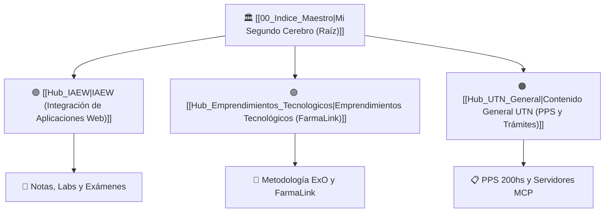

# 🧠 Mi Segundo Cerebro - UTN FRC

**Estudiante:** Martín Sciarra  
**Universidad:** UTN FRC (Ingeniería en Sistemas de Información)  
**Tags:** #hub #segundo-cerebro #utn #sistemas #moc  

---

## 🗺️ Mapa Central de Materias y Ramas



---

## 🧭 Acceso a las Ramas

* 🟣 **[[Hub_IAEW|Integración de Aplicaciones en Entorno Web (IAEW)]]** — 30 notas (APIs, OIDC, SAML, LDAP, Middlewares, RBAC, Labs).
* 🟢 **[[Hub_Emprendimientos_Tecnologicos|Emprendimientos Tecnológicos]]** — 6 notas (Metodología ExO, Sprint 1 y Proyecto **FarmaLink**).
* 🟠 **[[Hub_UTN_General|Contenido General de la UTN]]** — 2 notas (Instructivo de PPS 200hs y Servidor MCP UTN).

---

## ⚡ Últimas Notas Registradas (Dataview)

```dataview
TABLE file.mtime as "Modificado"
FROM ""
WHERE file.name != "00_Indice_Maestro" AND !contains(file.name, "Hub_")
SORT file.mtime DESC
LIMIT 8
```
