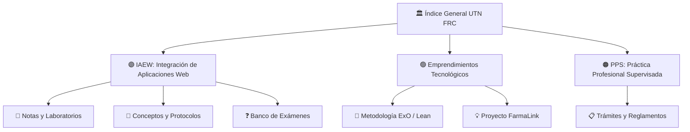

# 🏛️ Índice General - Baúl Académico UTN FRC

**Estudiante:** Martín Sciarra  
**Carrera:** Ingeniería en Sistemas de Información (UTN FRC)  
**Tags:** #hub #utn #sistemas #segundo-cerebro #moc  
**Fecha:** 2026-08-01  

---

## 🗺️ Mapa de Materias y Hubs Centrales

---

## 📚 1. Materias Activas

### 🟣 [[2026-08-10_integracion_aplicaciones_web_utn_frc|Integración de Aplicaciones en Entorno Web (IAEW)]]
* **Enfoque:** Arquitecturas distribuidas, APIs REST, JWT, OAuth2 / OIDC, PKCE, SAML, LDAP, WebSockets, Docker, MongoDB y seguridad de APIs con RBAC y Agentes de IA.
* **Laboratorios:**
  * [[2026-08-20_guia_trabajo_jwt_keycloak|Laboratorio Keycloak y JWT]]
  * [[2026-08-24_actividad_clase_02_ecommerce_api_rest_mongodb|Clase 02: API REST E-commerce con MongoDB]]
  * [[2026-08-31_actividad_clase_03_seguridad_api_middlewares_roles|Clase 03: Seguridad con Middlewares, Roles y API Key]]
* **Banco de Exámenes:**
  * [[2026-08-24_preguntas_examen_clase_02_api_mongodb|Preguntas Clase 02: APIs y Reglas de Negocio]]
  * [[2026-08-27_preguntas_examen_oidc_saml_ldap|Preguntas OIDC (PKCE), SAML 2.0 y LDAP]]
  * [[2026-08-31_preguntas_examen_clase_03_seguridad_rbac|Preguntas Clase 03: Seguridad y Roles]]

---

### 🟢 [[2026-08-14_emprendimientos_tecnologicos_utn_frc|Emprendimientos Tecnológicos]]
* **Enfoque:** Metodologías ágiles de startups, Lean Startup, Organizaciones Exponenciales (ExO), Business Model Canvas (BMC), Unit Economics y Pitch Decks.
* **Proyecto del Equipo:**
  * [[2026-08-14_metodologia_organizaciones_exponenciales_exo|Metodología ExO & Launchpad]]
  * [[2026-08-28_idea_proyecto_plataforma_farmacias_receta_electronica|Idea de Negocio: FarmaLink (Recetas Electrónicas)]]
  * [[2026-08-31_bmc_postits_plataforma_farmacias|Business Model Canvas: Post-its del Tablero]]

---

### 🟠 [[2026-08-13_instructivo_pps_utn_frc|Práctica Profesional Supervisada (PPS)]]
* **Enfoque:** Actividad curricular obligatoria de 200 horas de experiencia laboral técnica vinculada al perfil profesional.
* **Reglamentos y Accesos:**
  * [[2026-08-13_instructivo_pps_utn_frc|Instructivo, Requisitos y Acceso a UV]]

---
*Centro de navegación principal del Baúl de Notas UTN.*
