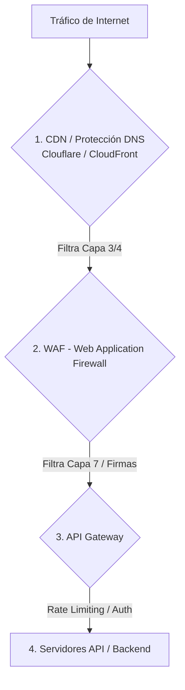

# Conceptos de Seguridad: Mitigación de Ataques DDoS en APIs
**Rama:** [[Hub_IAEW|IAEW]]

**Materia:** Integración de Aplicaciones en Entorno Web (UTN FRC)  
**Tags:** #materia/iaew
**Fecha:** 2026-08-13  
**Categoría:** Seguridad y Autenticación Web  

---

Un ataque **DDoS (Distributed Denial of Service)** en una API busca saturar los recursos del servidor (CPU, memoria, base de datos o ancho de banda) enviando un volumen masivo de peticiones falsas desde múltiples fuentes distribuidas (botnets), dejando la API inoperable para usuarios legítimos.

A diferencia de un servidor web tradicional, las APIs suelen procesar datos dinámicos en tiempo real (consultas complejas a bases de datos), lo que las hace especialmente vulnerables a ataques en la capa de aplicación (Capa 7 del modelo OSI).

---

## 🛡️ Estrategias de Mitigación y Gestión de Tráfico

Para proteger una API frente a ataques de denegación de servicio, se utilizan múltiples capas de seguridad:

### 1. CDN (Content Delivery Network) y Mitigación Anycast
* **Cómo funciona:** Plataformas como Cloudflare o AWS CloudFront distribuyen el tráfico mediante una red global de servidores (*Anycast*).
* **Beneficio:** Absorben ataques masivos de red (Capas 3 y 4, como inundaciones SYN o UDP) geográficamente antes de que lleguen a los servidores de origen.

### 2. WAF (Web Application Firewall)
* **Cómo funciona:** Monitorea y filtra el tráfico HTTP (Capa 7). Identifica patrones maliciosos, firmas de botnets conocidas, cabeceras sospechosas y comportamientos de scraping automatizado.
* **Beneficio:** Bloquea peticiones maliciosas específicas antes de que toquen el código de la API.

### 3. Rate Limiting y Throttling (Limitación de Tasa)
* **Cómo funciona:** Limita el número de peticiones que un cliente (identificado por IP, API Key o Token JWT) puede realizar en un periodo de tiempo (ej. máximo 60 peticiones por minuto).
  * **Throttling:** Reduce temporalmente la velocidad de respuesta para clientes que excedan su límite.
  * **HTTP 429:** Cuando se supera el límite, la API responde con el código de estado `429 Too Many Requests`.
* **Algoritmos Comunes:** *Token Bucket*, *Leaky Bucket*, o *Fixed Window*.

### 4. API Gateways (Puerta de Enlace)
* **Cómo funciona:** Actúa como punto único de entrada para todas las llamadas a microservicios.
* **Beneficio:** Centraliza la autenticación, la validación de tokens y el rate limiting. Si la API recibe peticiones no autenticadas masivamente, el Gateway las descarta de inmediato para no saturar las bases de datos del backend.

### 5. Caché de Respuestas (Caching)
* **Cómo funciona:** Guarda en memoria temporal (ej. con Redis o a nivel CDN) las respuestas a consultas frecuentes que no cambian constantemente (peticiones `GET`).
* **Beneficio:** Si los atacantes solicitan repetidamente el mismo recurso, la respuesta se sirve desde caché sin ejecutar lógica de backend ni consultar la base de datos.

---

## 🧠 Resumen Técnico de Respuestas ante Ataques

| Mecanismo | Capa OSI | Objetivo | Tipo de Acción |
| :--- | :--- | :--- | :--- |
| **Mitigación Volumétrica** | Capas 3 y 4 | Saturación de red / Ancho de banda | Bloqueo IP, enrutamiento Anycast |
| **WAF** | Capa 7 | Ataques dirigidos a vulnerabilidades | Filtrado de cabeceras, firmas HTTP |
| **Rate Limiting** | Capa 7 | Abuso de recursos / Fuerza bruta | Bloqueo temporal de origen (**HTTP 429**) |
| **API Gateway Auth** | Capa 7 | Peticiones fraudulentas al backend | Rechazo rápido de firmas JWT inválidas |

---
*Nota registrada automáticamente en el Baúl de Obsidian UTN.*
