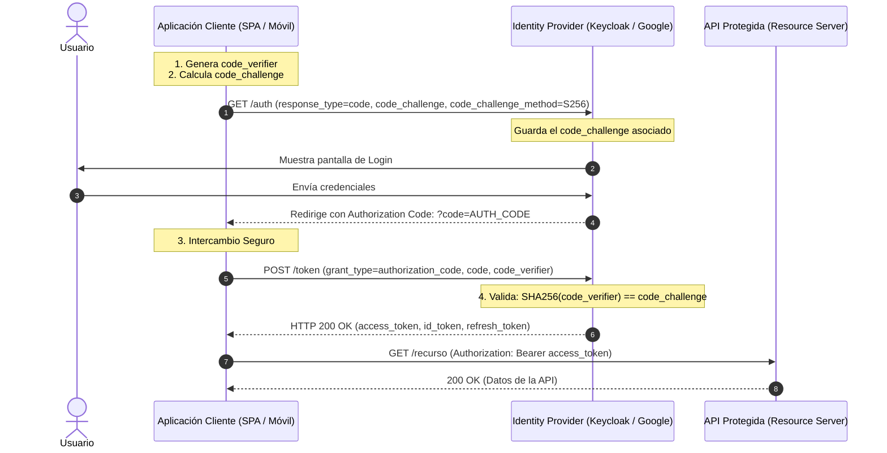

# Protocolo OpenID Connect (OIDC): Flujo Authorization Code con PKCE
**Rama:** [[Hub_IAEW|IAEW]]
**Tags:** #materia/iaew #seguridad #oidc #pkce #oauth2 #jwt #keycloak #utn  
**Fecha:** 2026-08-27  
**Categoría:** Seguridad e Identidad Digital  

---

## 🎯 1. ¿Qué es el Flujo Authorization Code + PKCE?

El flujo **Authorization Code con PKCE** (*Proof Key for Code Exchange*, especificado en el **RFC 7636**) es el mecanismo estándar de la industria más seguro y recomendado para:
* **SPAs (Single Page Applications):** Aplicaciones en React, Angular, Vue o Svelte.
* **Aplicaciones móviles:** iOS, Android, Flutter, React Native.
* **Clientes públicos en general:** Cualquier aplicación que se ejecute en el dispositivo del usuario final y no pueda mantener un `client_secret` en secreto.

> [!IMPORTANT]
> **El problema que resuelve PKCE:**  
> En clientes públicos, un atacante podría interceptar el `code` de autorización (por ejemplo, mediante esquemas de URL personalizados en móviles o extensiones maliciosas en el navegador). PKCE garantiza que **solo el cliente que inició la solicitud pueda canjear el código por tokens**.

---

## 🔐 2. Componentes Criptográficos de PKCE

PKCE introduce dos elementos dinámicos generados en cada sesión de autenticación:

1. **`code_verifier` (El Secreto Temporal):**  
   Una cadena aleatoria criptográficamente segura de alta entropía (entre 43 y 128 caracteres).
2. **`code_challenge` (El Desafío Público):**  
   El hash unidireccional del `code_verifier` codificado en Base64 URL-safe:
   $$\text{code\_challenge} = \text{BASE64URL-ENCODE}(\text{SHA256}(\text{code\_verifier}))$$

---

## 🔄 3. Diagrama de Secuencia del Flujo PKCE



---

## 🛠️ 4. Paso a Paso con Comandos de Ejemplo

### Paso 1: Generación de Claves PKCE en Bash/Terminal
```bash
# Generar el code_verifier
code_verifier=$(openssl rand -base64 64 | tr -d '=+/[:space:]' | cut -c -43)

# Generar el code_challenge con algoritmo S256
code_challenge=$(echo -n $code_verifier | openssl dgst -sha256 -binary | openssl base64 | tr '+/' '-_' | tr -d '=')
```

### Paso 2: Redirección al Endpoint de Autorización
```http
GET https://keycloak.example.com/realms/myrealm/protocol/openid-connect/auth?
  response_type=code
  &client_id=my-public-client
  &redirect_uri=https://miapp.com/callback
  &scope=openid%20profile%20email
  &code_challenge=CODE_CHALLENGE_GENERADO
  &code_challenge_method=S256
  &state=xyz123
```

### Paso 3: Canje del Código por Tokens (`POST /token`)
```bash
curl -X POST https://keycloak.example.com/realms/myrealm/protocol/openid-connect/token \
  -H "Content-Type: application/x-www-form-urlencoded" \
  -d "grant_type=authorization_code" \
  -d "client_id=my-public-client" \
  -d "code=AUTH_CODE_RECIBIDO" \
  -d "redirect_uri=https://miapp.com/callback" \
  -d "code_verifier=$code_verifier"
```

### Paso 4: Respuesta con Tokens
```json
{
  "access_token": "eyJhbGciOiJSUzI1NiIs...",
  "id_token": "eyJhbGciOiJSUzI1NiIs...",
  "refresh_token": "eyJhbGciOiJIUzI1NiIs...",
  "token_type": "Bearer",
  "expires_in": 3600,
  "scope": "openid profile email"
}
```

---

## 🌐 5. Casos Prácticos de la Cursada: Keycloak vs. Google Identity

| Proveedor | Endpoint de Autorización | Endpoint de Token |
| :--- | :--- | :--- |
| **Keycloak** | `/realms/{realm}/protocol/openid-connect/auth` | `/realms/{realm}/protocol/openid-connect/token` |
| **Google** | `https://accounts.google.com/o/oauth2/v2/auth` | `https://oauth2.googleapis.com/token` |

---
*Conexiones conceptuales:*
- [[2026-08-13_seguridad_y_validacion_oidc_oauth2|Seguridad y Validación en OIDC / OAuth2]]
- [[2026-08-13_obtencion_y_tipos_de_tokens|Obtención y Tipos de Tokens]]
- [[2026-08-20_conclusion_y_glosario_maestro_jwt_keycloak|Glosario Maestro: JWT y Keycloak]]

---

## 📝 2026-09-10 - Laboratorio Práctico: Implementación PKCE desde Cero con Keycloak y SPA

### 🎯 1. Objetivos del Laboratorio
1. Configurar un **Cliente Público OIDC** en Keycloak sin secreto de cliente (`Client authentication: OFF`).
2. Demostrar el canje de `authorization_code` mediante Postman enviando `code_verifier` correspondiente al `code_challenge` (S256).
3. Documentar los 4 errores típicos de seguridad OIDC / PKCE (`invalid_grant`, `invalid_client`).
4. Implementar una **Single Page Application (SPA)** nativa que corra en `http://localhost:4200` y ejecute el flujo PKCE dinámico con la Web Crypto API.

---

### ⚙️ 2. Configuración del Cliente Público en Keycloak
* **Realm:** `dds-materia`
* **Client ID:** `spa-69650-martinsciarra`
* **Client Authentication:** `OFF` *(Cliente público: no posee ni requiere client_secret)*
* **Standard Flow Enabled:** `ON` *(Habilita Authorization Code Flow)*
* **Direct Access Grants:** `OFF`
* **Implicit Flow:** `OFF`
* **Service Accounts:** `OFF`
* **Valid Redirect URIs:** `http://localhost:4200/*`
* **Web Origins (CORS):** `*`, `+`, `http://localhost:4200`

---

### 🧪 3. Matriz de Errores OIDC / PKCE Verificados

| Escenario | Parámetro Modificado | Respuesta de Keycloak | Causa de Seguridad |
| :--- | :--- | :--- | :--- |
| **1. Verifier Corrupto** | `code_verifier` alterado | `{"error": "invalid_grant", "error_description": "PKCE verification failed"}` | Previene la intercepción del código por un tercero que no conozca el verifier original. |
| **2. Código Reutilizado** | Mismo `code` enviado dos veces | `{"error": "invalid_grant", "error_description": "Code not valid"}` | El código de autorización es de un solo uso (Single-Use). |
| **3. Redirect URI Mismatch** | `redirect_uri` no registrada | `{"error": "invalid_grant", "error_description": "Redirect URI mismatch"}` | Evita vectores de ataque Open Redirector hacia dominios maliciosos. |
| **4. Cliente Desconocido** | `client_id` erróneo | `{"error": "invalid_client", "error_description": "Client not found"}` | El Identity Provider desconoce a la aplicación solicitante. |

---

### 💻 4. Implementación SPA (`iaew-spa-pkce`)
* **Ubicación:** `iaew-spa-pkce/`
* **Servidor Local:** Node.js HTTP escuchando en `http://localhost:4200` con fallback de routing SPA para `/login-callback`.
* **Motor Criptográfico:** `window.crypto.subtle.digest('SHA-256')` para generar el `code_challenge` en tiempo de ejecución en el navegador.
* **Funcionalidades en Vivo:**
  - Login delegado con redirección dinámica a Keycloak.
  - Intercepción de callback en `/login-callback` y canje POST `/token` vía `fetch()`.
  - Inspección de claims en JWT (`access_token`, `id_token`).
  - Botón de consulta a `/protocol/openid-connect/userinfo` con `Bearer` token.
  - Renovación de credenciales vía `refresh_token`.
  - Simulación de ataque PKCE en interfaz para demostración interactiva.

---

## 📝 [2026-09-15] - Profundización: ¿Qué resuelven OIDC y PKCE si el JWT ya resuelve el rendimiento?

### ❓ La Duda Conceptual:
*Si el JWT ya evita los cuellos de botella en la base de datos gracias a su validación matemática en memoria (Stateless), ¿para qué necesitamos OIDC y PKCE? ¿Qué problema vienen a solucionar?*

---

### 💡 La Distinción Clave: Rendimiento vs. Seguridad y Arquitectura

| Tecnología | Dimensión que resuelve | Pregunta que responde |
| :--- | :--- | :--- |
| **JWT** | **Rendimiento / Transporte** (Formato de datos) | *¿Cómo viajan los permisos sin saturar la BD en cada petición?* |
| **OIDC** | **Identidad / Arquitectura** (Protocolo de autenticación) | *¿Quién es el usuario y cómo evito que mi API gestione contraseñas?* |
| **PKCE** | **Seguridad Criptográfica** (Protección del canal público) | *¿Cómo evito que un atacante robe el token en una SPA o App móvil?* |

> [!NOTE]
> **JWT es solo un contenedor (un "formato de pasaporte").**  
> Que el pasaporte sea liviano y fácil de leer en aduana (Stateless) no resuelve **quién emite el pasaporte**, **cómo se valida la identidad del ciudadano de forma segura** ni **cómo evitar que te roben el pasaporte en el camino**. De eso se encargan OIDC y PKCE.

---

### 🏛️ 1. ¿Qué problema soluciona OIDC (OpenID Connect)?

En un "login casero" tradicional:
1. **Tu backend manipula contraseñas directas:** Recibe contraseñas en texto plano por HTTP, las hashea, gestiona el recupero de contraseña, bloqueos por fuerza bruta, y almacenamiento sensible. Si hackean tu base de datos, roban los hashes de todos tus usuarios.
2. **Imposibilidad de Single Sign-On (SSO):** Si tu empresa tiene 4 aplicaciones (Tienda Web, App Móvil, Panel Administrativo, CRM), el usuario tendría que crearse 4 cuentas o tus 4 backends tendrían que compartir la misma base de datos acoplada.
3. **Falta de funcionalidades modernas:** Implementar autenticación de dos factores (MFA/2FA), inicio de sesión con Google/GitHub o biometría requiere escribir miles de líneas de código propenso a fallas en cada aplicación.

**Lo que OIDC soluciona:**
* **Desacoplamiento total de credenciales:** Tu API y tu frontend **NUNCA tocan la contraseña del usuario**. El usuario se loguea en el IdP (Keycloak, Google, etc.).
* **Estandarización de Identidad:** Introduce el **`id_token`** y el endpoint `/userinfo`, entregando nombre, email, roles y foto de perfil en un estándar universal (RFC).
* **SSO y MFA centralizados:** Te da inicio de sesión único entre múltiples sistemas y soporte para 2FA/WebAuthn sin cambiar una sola línea del backend de negocio.

---

### 🛡️ 2. ¿Qué problema soluciona PKCE (Proof Key for Code Exchange)?

OAuth 2.0 tradicional se diseñó pensando en clientes confiables (*Confidential Clients*): servidores backend que pueden ocultar un `client_secret` en sus variables de entorno.

Pero con la llegada de las **SPAs (React, Angular, Vue)** y las **Apps Móviles (iOS, Android)**, surgió un dilema de seguridad crítico: **son Clientes Públicos**.

#### El Ataque de Intercepción de Código (Sin PKCE):
```
[Navegador / Móvil] ────(1) Inicia Login────► [Keycloak / IdP]
[Navegador / Móvil] ◄───(2) Redirige con ?code=XYZ ─── [Keycloak / IdP]
         │
         ▼ ¡INTERCEPCIÓN!
   (App Maliciosa en Android intercepta el esquema 'miapp://'
    o Extensión maliciosa de Chrome lee la URL)
         │
         ▼
[Atacante] ───(3) Canjea POST /token con code=XYZ ───► [Keycloak / IdP]
[Atacante] ◄──(4) Recibe Access Token y roba la cuenta ── [Keycloak / IdP]
```

Como la SPA o app móvil no puede tener un secreto guardado (cualquiera abriría DevTools o descompilaría el `.apk`), el IdP le entregaba el token a quien tuviera el `code`.

#### La Solución de PKCE (RFC 7636):
PKCE crea un **secreto dinámico de un solo uso en tiempo de ejecución**:
1. La SPA genera un secreto en memoria (`code_verifier`) y envía solo su hash criptográfico (`code_challenge = SHA256(verifier)`) al IdP.
2. Cuando el IdP redirige con el `code`, **si un atacante lo intercepta, NO LE SIRVE DE NADA**.
3. Para canjear el `code`, el IdP exige enviar el `code_verifier` en texto plano.
4. El atacante no puede adivinar el `code_verifier` (es una función hash unidireccional SHA-256). Solo la pestaña legítima que inició el flujo lo tiene en memoria.
5. El IdP calcula `SHA256(verifier)` y verifica que coincida con el challenge guardado. Si coincide, emite los tokens.

---

### 🧩 Conclusión: La Sinergia Perfecta

```
┌─────────────────────────┐
│     OPENID CONNECT      │ ──► Garantiza QUIÉN ES el usuario (Identidad, SSO, MFA)
│         (OIDC)          │     sin que tu API toque contraseñas.
└────────────┬────────────┘
             │
             ▼
┌─────────────────────────┐
│          PKCE           │ ──► Garantiza CÓMO VIAJA la entrega del token al frontend
│       (RFC 7636)        │     blindando el canje contra robo o intercepción de código.
└────────────┬────────────┘
             │
             ▼
┌─────────────────────────┐
│       JWT BEARER        │ ──► Garantiza CÓMO SE CONSUME la API con alto rendimiento,
│       (Stateless)       │     permitiendo validar permisos en RAM sin saturar la BD.
└─────────────────────────┘
```

