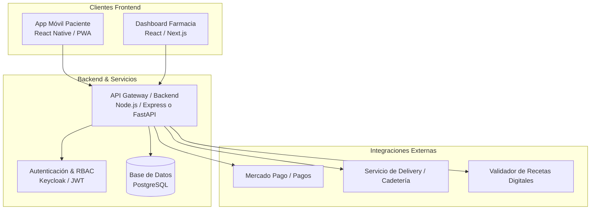

# Proyecto: Plataforma Digital de Gestión de Recetas Electrónicas y Pedidos de Farmacia
**Rama:** [[Hub_Emprendimientos_Tecnologicos|Emprendimientos Tecnológicos]]
**Tags:** #materia/emprendimientos-tecnologicos #idea-proyecto #healthtech #marketplace #canvas #lean-startup #receta-electronica  
**Fecha:** 2026-08-28  

---

## 💡 1. Visión y Propósito de Transformación Masiva (PTM / MTP)

> **PTM:** *"Democratizar el acceso ágil, seguro y transparente a los medicamentos esenciales, eliminando las barreras físicas y la burocracia de la salud."*

---

## 🎯 2. Encaje Problema-Solución (Value Proposition Canvas)

```
       PACIENTES (B2C)                         FARMACIAS (B2B)
┌───────────────────────────────┐       ┌───────────────────────────────┐
│ • Pains: Traslados, colas,    │       │ • Pains: Caos de WhatsApp,    │
│   falta de stock, fotos por WP│       │   validación manual, demoras  │
│ • Gains: Subir receta digital,│  ◄─►  │ • Gains: Panel centralizado,  │
│   cobertura clara, delivery   │       │   cobro asegurado, más ventas │
└───────────────────────────────┘       └───────────────────────────────┘
```

### Lado A: Paciente (B2C)
* **Tareas (Customer Jobs):** Conseguir medicación recetada o de venta libre, validar descuento de obra social/prepaga y recibirla en su casa o retirar sin espera.
* **Dolores (Pains):** Ir físicamente a la farmacia solo para entregar un papel/PDF, hacer filas, descubrir que no hay stock, enviar mensajes por WhatsApp que nadie responde a tiempo.
* **Aliviadores de Dolor y Ganancias (Pain Relievers & Gains):**
  * Subida de receta electrónica (código de barras, QR o PDF del médico).
  * Cotización automática con cobertura de obra social calculada en vivo.
  * Opciones: Envío a domicilio (*delivery*) o retiro prioritario en mostrador (*Click & Collect*).

### Lado B: Farmacia de Barrio / Cadena (B2B)
* **Tareas:** Atender clientes, validar recetas ante obras sociales, gestionar stock, facturar y despachar.
* **Dolores:** Colapso de WhatsApp con fotos borrosas de recetas, consultas repetitivas de stock, falta de confirmación de pago y desorganización de pedidos.
* **Aliviadores de Dolor y Ganancias:**
  * Tablero Kanban centralizado (*Nuevos ➔ Validando Cobertura ➔ Preparado ➔ En Envío*).
  * Integración con pasarela de cobro para asegurar la venta antes de preparar el pedido.
  * Aumento del radio de cobertura y fidelización de clientes del barrio.

---

## 📊 3. Business Model Canvas (BMC con Código de Colores)

| Bloque | Color Azul: Segmento Pacientes (B2C) | Color Verde: Segmento Farmacias (B2B) | Color Naranja: Laboratorios / Marcas |
| :--- | :--- | :--- | :--- |
| **Propuesta de Valor** | Comprar medicamentos con receta online, sin filas y con entrega rápida. | Digitalización de pedidos, orden operativo (adiós WhatsApp) y aumento de ventas. | Canal de marketing segmentado y analítica de tendencias de consumo farmacéutico. |
| **Segmento de Clientes** | Pacientes crónicos, adultos mayores/familiares, personas con poco tiempo. | Farmacias independientes y pequeñas cadenas de barrio. | Laboratorios de productos de venta libre (OTC), dermocosmética y suplementos. |
| **Canales** | App móvil (PWA/iOS/Android), geolocalización, referidos médicos. | Visitas comerciales B2B, cámaras farmacéuticas, portal web de farmacias. | Portal publicitario B2B para laboratorios. |
| **Relación con Clientes** | Automatizada, autoservicio con notificaciones push/WhatsApp bot. | Soporte técnico dedicado, onboarding y capacitación a farmacéuticos. | Gestión de cuentas corporativas. |
| **Fuentes de Ingresos** | Costo de envío / Fee de servicio por pedido. | Suscripción mensual SaaS (Plan Básico / Pro) o comisión por pedido despachado. | Publicidad de productos de venta libre (banners, productos destacados). |
| **Recursos Clave** | Plataforma cloud escalable, base de datos de medicamentos, sistema de geolocalización. | Red de farmacias adheridas, equipo de soporte y ventas B2B. | Motor de segmentación y analítica de datos. |
| **Actividades Clave** | Desarrollo de software, marketing digital para pacientes, soporte al usuario. | Onboarding y soporte a farmacias, integración con sistemas de validación. | Gestión de pautas publicitarias éticas. |
| **Socios Clave** | Empresas de logística/cadetería, pasarelas de pago (Mercado Pago). | Colegios farmacéuticos, validadoras de recetas (PAMI, Traditum, MisRx). | Marcas de dermocosmética y laboratorios OTC. |
| **Estructura de Costos** | Infraestructura Cloud (AWS/GCP), pasarelas de pago, marketing y adquisición (CAC), soporte al cliente. | | |

---

## ⚖️ 4. Aspectos Legales y Normativos Críticos (Regulación Argentina / ANMAT)

1. **Medicamentos Bajo Receta:** La ley prohíbe terminantemente hacer publicidad de medicamentos bajo receta médica. La publicidad debe ser **exclusiva de productos de Venta Libre (OTC)**, suplementos dietarios, cuidado personal, dermocosmética y accesorios.
2. **Validación de la Receta:** La plataforma actúa como canal de comunicación y gestión logística; el farmacéutico matriculado sigue siendo el único responsable legal de la validación y dispensa.
3. **Privacidad y Datos de Salud:** Cumplimiento de la **Ley de Protección de Datos Personales (Ley 25.326)** para historiales de medicación e información sensible.

---

## 🛠️ 5. Arquitectura Técnica y Roadmap del MVP



### Funcionalidades Mínimas Viables (MVP):
1. **Módulo Paciente:**
   * Registro y subida de foto o PDF de la receta digital (o código de barras/QR).
   * Selección de farmacia más cercana por geolocalización.
   * Elección entre retiro en local o envío a domicilio.
   * Pago online seguro vía Mercado Pago.
2. **Módulo Farmacia:**
   * Panel de control web tipo Kanban: *Nuevas Solicitudes ➔ En Preparación ➔ Listo para Retiro / En Envío*.
   * Chat directo integrado y botón de aceptación/rechazo de receta con motivo.
   * Notificación automática al paciente por push/SMS sobre el estado de su pedido.
