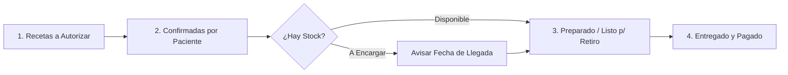

# Idea Preliminar: Plataforma de Gestión de Recetas y Pedidos para Farmacias y Pacientes
**Rama:** [[Hub_Emprendimientos_Tecnologicos|Emprendimientos Tecnológicos]]
**Tags:** #materia/emprendimientos-tecnologicos #idea-proyecto #healthtech #mvp #validacion #lean-startup #receta-electronica  
**Fecha:** 2026-08-30  

---

## 💡 1. Resumen Ejecutivo de la Propuesta

Plataforma digital para **estandarizar y optimizar la comunicación entre pacientes y farmacias**, eliminando el uso desordenado de WhatsApp y evitando traslados innecesarios a los locales físicos.

```
┌──────────────────────────────────────┐               ┌──────────────────────────────────────┐
│            PACIENTE (B2C)            │               │            FARMACIA (B2B)            │
├──────────────────────────────────────┤               ├──────────────────────────────────────┤
│ • Consulta con DNI y N° Afiliado     │  ───────────▶ │ • Valida receta en sistema prepaga   │
│ • Conoce precio final con descuento  │ ◀───────────  │ • Confirma stock o fecha de llegada  │
│ • Paga online y retira sin cola      │               │ • Gestiona todo en tablero Kanban    │
└──────────────────────────────────────┘               └──────────────────────────────────────┘
```

---

## 🎯 2. Problemas Concretos que Resuelve

### Para el Paciente:
* **Viajes y colas innecesarias:** Evita ir a la farmacia solo para que le digan que la receta tiene un error, que la obra social la rebotó o que superó el tope mensual de principio activo.
* **Falta de stock:** Permite saber con certeza si el medicamento está disponible o cuándo llega antes de salir de casa.
* **Falta de respuesta en WhatsApp:** Reemplaza mensajes no leídos o desatendidos por un canal con estados claros en tiempo real.

### Para la Farmacia:
* **Colapso de WhatsApp:** Centraliza consultas dispersas, audios y fotos borrosas en un único panel ordenado.
* **Tiempos de mostrador:** Descongestiona la fila presencial; el farmacéutico valida las recetas en tiempos muertos y deja los paquetes listos para entrega rápida (*Click & Collect*).
* **Cobro asegurado:** El paciente confirma y abona antes del retiro/despacho, reduciendo cancelaciones.

---

## ⚖️ 3. Alcance y Reglas de Negocio Definidas

1. **Gestión de Recetas (Digital y Papel):**
   * El paciente puede ingresar su **DNI y número de afiliado** para que el farmacéutico consulte la receta electrónica directamente en el sistema de la obra social/prepaga (o subir foto si es en papel).
2. **Validación Profesional:**
   * La plataforma **no valida recetas ni contrata farmacéuticos propios**. Cada farmacia receptora realiza la validación oficial en sus sistemas habituales.
3. **Logística y Envíos:**
   * La app **no cuenta con flota de cadetería propia**. Ofrece retiro prioritario en mostrador y habilita envío a domicilio únicamente si la farmacia ya dispone de delivery propio.
4. **Privacidad y Confidencialidad:**
   * No se almacena historial clínico ni información médica innecesaria del paciente, garantizando el cumplimiento de la Ley de Protección de Datos Personales.

---

## 🖥️ 4. Flujo Operativo y Tablero Kanban de la Farmacia (Web)



### Columnas del Tablero:
1. **Recetas a Autorizar:** Solicitudes entrantes pendientes de validación en el validador de la obra social/prepaga.
2. **Confirmadas por el Paciente:** La farmacia informa el copago/descuento final y el paciente aprueba la compra.
3. **Disponibilidad:**
   * *Medicamento en Stock:* Pasa a preparación inmediata.
   * *A Encargar:* Se notifica al paciente la fecha y turno estimado de llegada.
4. **Listo para Retiro / Envío:** Notificación al paciente para retirar en mostrador exclusivo o despacho por delivery de la farmacia.
5. **Estado de Pago:** Indicador claro de *Pagado* o *Pendiente de pago en mostrador*.

---

## 📋 5. Próximos Pasos (Validación de Hipótesis)
* [ ] Entrevistar a farmacias de barrio para validar si el caos de WhatsApp es un dolor prioritario.
* [ ] Entrevistar a pacientes crónicos y recurrentes sobre su disposición a usar una app para validar recetas antes de ir.
* [ ] Iterar wireframes en Google Stitch y Mural con base en el feedback obtenido.
