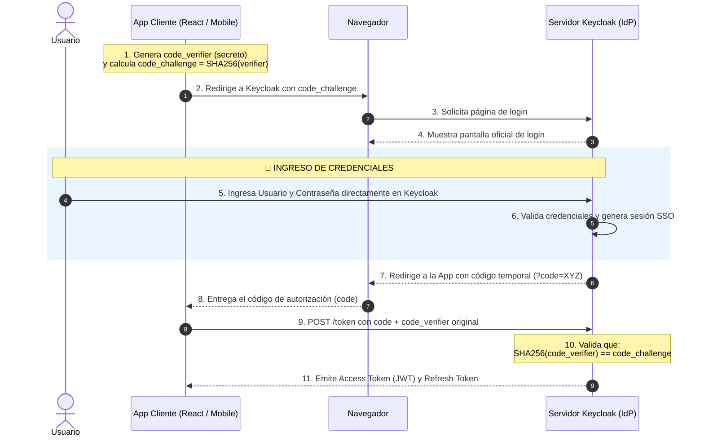

# Flujo Password (Deprecado), Gestión de Secretos y Autorización con PKCE

**Materia Hub:** [[2026-08-10_integracion_aplicaciones_web_utn_frc|Integración de Aplicaciones Web (IAEW)]]  
**MOC Principal:** [[Hub_IAEW|Hub IAEW]]  
**Tags:** #materia/iaew #seguridad #oauth2 #oidc #keycloak #pkce #postman #jwt #arquitectura  
**Fecha:** 2026-09-03  

---

## 🎯 1. Resumen y Temario de la Clase (2026-09-03)
En la clase de hoy se analizaron a fondo las limitaciones de seguridad del flujo tradicional por credenciales de usuario (**Password Flow / ROPC**), su deprecación en **OAuth 2.1**, la correcta gestión de secretos en el backend y el estándar moderno para clientes públicos e interactivos: **Authorization Code con PKCE** (*Proof Key for Code Exchange*).

---

## 🛠️ 2. Práctica: Configuración en Keycloak y Postman (`grant_type=password`)

### A. Configuración del Cliente en Keycloak (AIM)
* **Realm:** `dds-materia`
* **Direct Access Grants:** En la configuración de capacidades (*Capability config / Settings*), es obligatorio tildar la opción **Direct access grants**. Esta directiva es la que permite a Keycloak aceptar peticiones con `grant_type=password`.
* **Client Authentication:** Si se deja en `ON`, se genera un `client_secret` que debe ser enviado junto con la petición.

### B. Creación de Usuario sin Cambio Obligatorio de Contraseña
* Al crear el usuario en **Users ➔ Add user**, se asigna la contraseña en la pestaña **Credentials**.
* ⚠️ **Detalle Crítico:** La opción **`Temporary`** debe configurarse en **`OFF`**.  
  * *Motivo:* Si queda en `ON`, Keycloak exige un cambio de contraseña interactivo en el primer inicio de sesión. Como el flujo password se ejecuta mediante llamadas HTTP directas sin pantalla web, Keycloak rechaza la solicitud de token.

### C. Solicitud en Postman
* **Método:** `POST` *(un error 405 Method Not Allowed indica el uso erróneo de `GET`)*.
* **URL:** `https://labsys.frc.utn.edu.ar/aim/realms/dds-materia/protocol/openid-connect/token`
* **Body:** `x-www-form-urlencoded`
  * `grant_type`: `password`
  * `client_id`: `69650-martinsciarra-lab`
  * `client_secret`: `WtWoiQvYGtoikvrnuaLajyn6VU9s9wgN`
  * `username`: `<nombre-usuario>`
  * `password`: `<contraseña-usuario>`
  * `scope`: `openid`
* **Respuesta:** Status `200 OK` con `access_token` (JWT que incluye el claim `preferred_username`).

---

## 🔐 3. Dónde y Cómo se Almacena el `client_secret` en una App Propia

### Regla Fundamental de Arquitectura:
> ⚠️ **El `client_secret` NUNCA debe estar en el frontend (React, Angular, apps móviles)** ni escribirse en código fuente directo (hardcoded). Pertenece **exclusivamente al servidor backend** (*Confidential Client*).

### Implementación en Desarrollo Local:
1. **Archivo `.env`:** Se almacena en la raíz del proyecto backend:
   ```env
   KEYCLOAK_BASE_URL=https://labsys.frc.utn.edu.ar/aim
   KEYCLOAK_REALM=dds-materia
   CLIENT_ID=69650-martinsciarra-lab
   CLIENT_SECRET=WtWoiQvYGtoikvrnuaLajyn6VU9s9wgN
   ```
2. **Uso en Backend (ej. Node.js):** Se consume mediante `process.env.CLIENT_SECRET` usando librerías como `dotenv`.
3. **Archivo `.gitignore`:** Es indispensable incluir `.env` para evitar fugas de credenciales en repositorios como GitHub.

### Implementación en Producción:
* **PaaS / Hosting (Render, Railway, Heroku):** Se carga en la sección de *Environment Variables* del panel.
* **Contenedores (Docker / Kubernetes):** Inyección mediante `docker-compose` o *Kubernetes Secrets*.
* **Nubes Corporativas (AWS, Azure, GCP):** Bóvedas de secretos dedicadas como *AWS Secrets Manager* o *HashiCorp Vault*.

---

## 🚫 4. ¿Por qué el Flujo Password (ROPC) está Deprecado?

El flujo **Resource Owner Password Credentials** fue **eliminado formalmente en OAuth 2.1** y desaconsejado por el IETF (*OAuth 2.0 Security Best Current Practice*) por los siguientes motivos:

1. **Viola el Principio de OAuth:** El cliente tiene acceso directo a la contraseña del usuario en texto plano. Si la app cliente es vulnerada, las contraseñas quedan expuestas.
2. **Incompatible con MFA / 2FA:** Al ser una petición HTTP pura, no permite presentar desafíos interactivos (SMS, Authenticator, biometría, WebAuthn).
3. **Incompatible con Políticas de Contraseña:** Falla ante cambios obligatorios de clave o términos y condiciones no aceptados.
4. **No permite Single Sign-On (SSO):** No genera una sesión de navegador en el Identity Provider; el usuario debe reingresar su clave en cada aplicación.
5. **Fomenta el Phishing:** Enseña al usuario a tipear sus credenciales en formularios de terceros en lugar de verificar la URL del IdP oficial.

*Casos residuales de uso:* Exclusivamente en sistemas *legacy* imposibilitados de usar navegadores embebidos o scripts CLI internos altamente confiables.

---

## 🛡️ 5. El Estándar Moderno: Authorization Code con PKCE ("Pixi")

PKCE (*Proof Key for Code Exchange*, RFC 7636) es la extensión de seguridad diseñada para **clientes públicos** (Single Page Applications y Apps Móviles) que no pueden ocultar un `client_secret`.

### ¿Quién genera el `code_verifier`?
* **Lo genera el CLIENTE (la app), NUNCA el servidor.**
* El cliente crea una cadena aleatoria secreta (`code_verifier`) y calcula su hash SHA-256 (`code_challenge`).
* El servidor solo recibe el `code_challenge` al inicio. Luego, en el canje final del token, el cliente envía el `code_verifier` original. El IdP verifica que `SHA256(verifier) == challenge`.

### ¿En qué momento se ingresa la contraseña?
* **Únicamente en la pantalla oficial de Keycloak**.
* La app cliente redirige al navegador a Keycloak; el usuario escribe su clave en la página del IdP y la app cliente **jamás ve ni toca la contraseña**.

### Diagrama de Secuencia Completo de PKCE:



---

## ⚖️ 6. Comparativa: Login de Proyecto Final vs. Keycloak Empresarial + PKCE

| Dimensión | Login Típico de Proyecto Final (In-House) | Arquitectura Empresarial (Keycloak + PKCE) |
| :--- | :--- | :--- |
| **Almacenamiento de Contraseñas** | Tabla `usuarios` en la base de datos propia (hash bcrypt). | Centralizado en el IdP (Keycloak). La app no almacena contraseñas. |
| **Formulario de Login** | Formulario propio en el frontend de la app. | Pantalla oficial servida por Keycloak (aislada y segura). |
| **Acceso a la Contraseña** | El backend propio recibe y procesa la clave en texto plano. | Ni el frontend ni el backend del cliente ven la contraseña. |
| **Autenticación Multi-Factor (MFA)** | Debe programarse desde cero (complejo). | Se activa de forma nativa por configuración en el IdP. |
| **Single Sign-On (SSO)** | Inexistente (se requiere login independiente por app). | Nativo (una sola sesión válida para todo el ecosistema de apps). |
| **Federación (Google / GitHub)** | Integración y mantenimiento manual por cada proveedor. | Configurable con pocos clics en el IdP sin modificar código. |
| **Firma Criptográfica de Tokens** | Clave simétrica compartida (`HS256`). | Claves asimétricas pública/privada (`RS256` vía `/certs` JWKS). |

---

## 📌 7. Conclusión: ¿Cuándo debe usarse PKCE?

> PKCE debe usarse siempre que un usuario humano inicie sesión desde una aplicación frontend (React, Angular) o móvil (Android, iOS).  
> Como estas apps corren en el dispositivo del cliente, no pueden ocultar un `client_secret` sin que alguien lo inspeccione y lo robe.  
> PKCE resuelve esto creando una "llave" temporal y única en cada login para blindar el código que devuelve el servidor de identidad.  
> De esta manera, se garantiza que ningún atacante o app maliciosa pueda interceptar la redirección del navegador para robar el token.  
> Hoy en día es el estándar obligatorio de la industria (OAuth 2.1) que reemplaza de forma definitiva al viejo flujo de usuario y contraseña.  
> En resumen: si tu sistema tiene usuarios interactivos y corre del lado del cliente, PKCE es el método que tenés que implementar.
