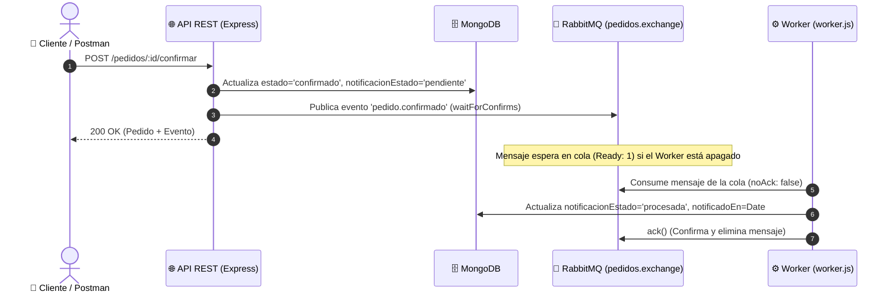

# Actividad Práctica Clase 04: Mensajería Asincrónica con RabbitMQ y Workers
**Rama:** [[Hub_IAEW|IAEW]]
**Universidad:** UTN FRC (Facultad Regional Córdoba)  
**Tags:** #materia/iaew #rabbitmq #mensajeria #asincronico #workers #desacople #eventos #utn  
**Fecha:** 2026-09-07  

---

## 🎯 1. Objetivo de la Clase
Implementar un **desacople asincrónico** en la confirmación de pedidos utilizando **RabbitMQ** como message broker:
1. **Confirmación Sincrónica Rápida:** La API confirma el pedido en MongoDB y responde inmediatamente al cliente (`200 OK`).
2. **Publicación de Evento:** Se emite el evento `pedido.confirmado` al exchange directo `pedidos.exchange`.
3. **Procesamiento en Segundo Plano (Worker):** Un consumidor independiente escucha la cola `notificaciones.pedido-confirmado`, actualiza el estado a `procesada` y emite el `ack()`.

---

## 🧩 2. Arquitectura y Componentes Implementados

### Elementos del Contrato de Mensajería:
* **Exchange Directo:** `pedidos.exchange`
* **Routing Key:** `pedido.confirmado`
* **Cola Durable:** `notificaciones.pedido-confirmado`
* **Estados de Notificación:** `'pendiente'` $\rightarrow$ `'procesada'`

---

## 🧪 3. Demostración del Desacople (Fase A5)

1. **Worker Detenido:** Al confirmar el pedido, la API responde `200 OK` y en la consola de RabbitMQ la cola pasa a **`Ready: 1`**. El mensaje no se pierde y espera en disco.
2. **Worker Activo:** Al iniciar `npm run worker`, el consumidor toma el mensaje, persiste en MongoDB con `notificadoEn` y ejecuta el `ack()`. La cola vuelve automáticamente a **`Ready: 0`**.
3. **Casos de Error:** Se comprobó que peticiones con `401 Unauthorized`, `403 Forbidden` y `409 Conflict` (confirmación repetida o sin stock) **no generan eventos espurios** en RabbitMQ.

---

## 🧠 4. Preguntas Conceptuales de Examen

### A) El problema de la Escritura Dual y el Patrón Outbox
* **Problema:** Si MongoDB confirma el pedido y RabbitMQ falla antes de publicar, la base de datos queda actualizada pero el resto del sistema nunca se entera.
* **Riesgo de reintentar a ciegas:** Reenviar la petición puede descontar stock dos veces o generar conflictos de estado (`409`).
* **Solución:** **Transactional Outbox Pattern**, donde el evento se guarda en una tabla/colección `outbox` dentro de la misma transacción de MongoDB, y un proceso garantizado lo publica en RabbitMQ.

### B) Gobernanza de Agentes de IA y Seguridad
* **Scope necesario:** Para confirmar pedidos, un agente debe contar estrictamente con el scope `confirm:pedidos`.
* **Manejo de errores 503:** Ante una falla de mensajería (`503`), el agente no debe reintentar el POST a ciegas; debe realizar un `GET /pedidos/:id` para verificar si el recurso ya quedó en estado `confirmado`.
