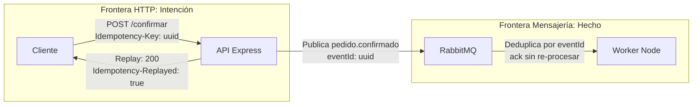
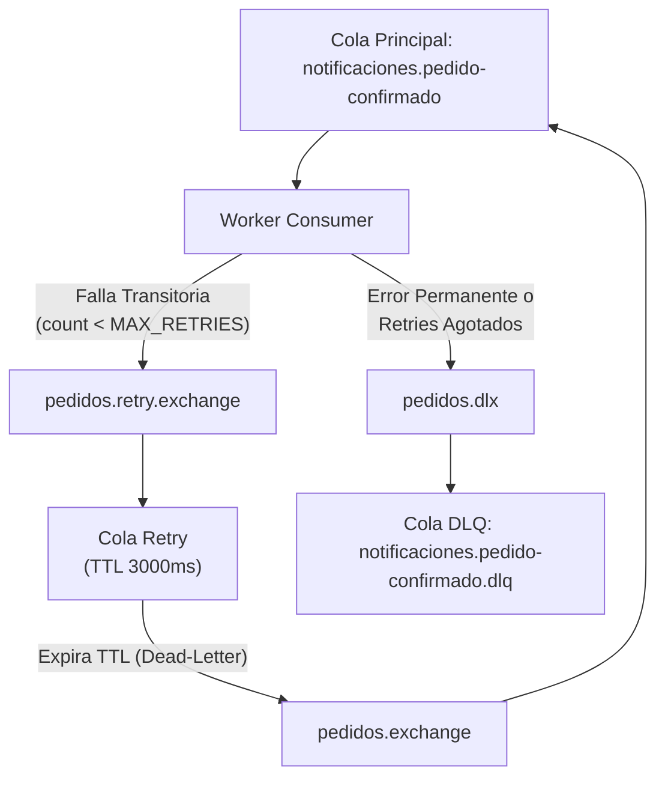

# Bitácora Clase 05: Resiliencia de Integraciones — Idempotencia, Retries y DLQ
**Rama:** [[Hub_IAEW|IAEW]]  
**Tags:** #materia/iaew #resiliencia #idempotencia #rabbitmq #mongodb #dlq #retries #microservicios #arquitectura  
**Fecha:** 2026-09-17  
**Estado:** Completado 100%  

---

## 🎯 1. Introducción y Problema que Resolvemos

Una integración distribuida no falla únicamente cuando devuelve un error HTTP 500. Falla de formas más complejas:
1. **Tarde (Timeouts):** La operación terminó en el servidor pero la respuesta se perdió o tardó en la red.
2. **Duplicada:** La misma intención o mensaje arriba más de una vez.
3. **Parcial:** MongoDB actualizó el pedido, pero RabbitMQ no pudo confirmar la publicación del evento.
4. **Indisponible:** Un servicio dependiente no acepta peticiones temporalmente.
5. **Permanente (Poison message):** El mensaje contiene datos corruptos que jamás podrán ser procesados.

Para resolver esto, en esta clase protegemos dos fronteras:
* En **HTTP**, el header `Idempotency-Key` reconoce una misma intención.
* En **Mensajería**, el `eventId` reconoce un mismo hecho inmutable del negocio.

---

## 📐 2. Las Dos Fronteras de Identidad

* **Idempotencia Técnica:** Guardar la clave en la colección `Pedido` con índice `unique` y `sparse: true`.
* **Idempotencia de Negocio:** Descontar stock una sola vez y emitir un solo evento.
* **At Least Once:** RabbitMQ reentrega mensajes si no recibe el `ack`. El worker deduplica usando la colección `EventoProcesado`.

---

## 🔁 3. Topología de Retry y Dead Letter Queue (DLQ)

> [!WARNING]
> **Por qué NUNCA usar `nack(requeue=true)`:**
> Reencolar de forma inmediata provoca un ciclo infinito al 100% de CPU si el error persiste, bloqueando mensajes sanos. El retry debe usar colas de espera con TTL y un límite de reintentos (`MAX_RETRIES=3`).

---

## 🧪 4. Matriz de Contratos y Códigos de Error

| Escenario | Header / Condición | HTTP Status | Code / Header Respuesta | Acción |
| :--- | :--- | :---: | :--- | :--- |
| **Sin Header** | `Idempotency-Key` ausente | `400` | `IDEMPOTENCY_KEY_REQUIRED` | Cliente debe enviar clave válida. |
| **Formato Inválido** | Menor a 8 o caracteres raros | `400` | `IDEMPOTENCY_KEY_INVALID` | Usar regex `^[A-Za-z0-9._:-]{8,128}$`. |
| **Primera Ejecución** | Clave nueva válida | `200` | `Idempotency-Replayed: false` | Efecto aplicado, evento publicado. |
| **Replay Mismo Pedido** | Misma clave en pedido confirmado | `200` | `Idempotency-Replayed: true` | Devuelve resultado previo sin tocar stock. |
| **Conflicto Mismatch** | Pedido confirmado con OTRA clave | `409` | `IDEMPOTENCY_KEY_MISMATCH` | No generar nueva confirmación. |
| **Conflicto Reúso** | Misma clave en OTRO pedido | `409` | `IDEMPOTENCY_KEY_REUSED` | Usar una clave distinta por pedido. |

---

## 🤖 5. Pautas para Agentes de Inteligencia Artificial

Si un agente de IA interactúa con la API y recibe un **HTTP 503** o un **Timeout**:
1. **NUNCA crear una nueva clave de idempotencia:** Asumir que la intención sigue siendo la misma.
2. **Consultar primero (`GET /pedidos/:id`):** Verificar si el pedido ya fue confirmado.
3. **Reintentar con la misma clave:** Si no se pudo determinar, reenviar con el mismo header.
4. **Exponential Backoff con Jitter:** Separar los reintentos de forma no determinística.
5. **Respetar `retryable` y `action`:** Interpretar los campos del JSON antes de decidir.

---
*Conexiones conceptuales:*
- [[2026-08-31_actividad_clase_03_seguridad_api_middlewares_roles|Clase 03: Seguridad con Middlewares y Roles]]
- [[2026-09-03_flujo_password_deprecado_y_pkce_oauth2|Clase 04: Publicación Asíncrona con RabbitMQ]]
- [[2026-08-10_apis_y_servicios_web|APIs y Servicios Web]]
- [[2026-08-13_gestion_apis_ataques_ddos|Gestión de APIs y Ataques DDoS]]
