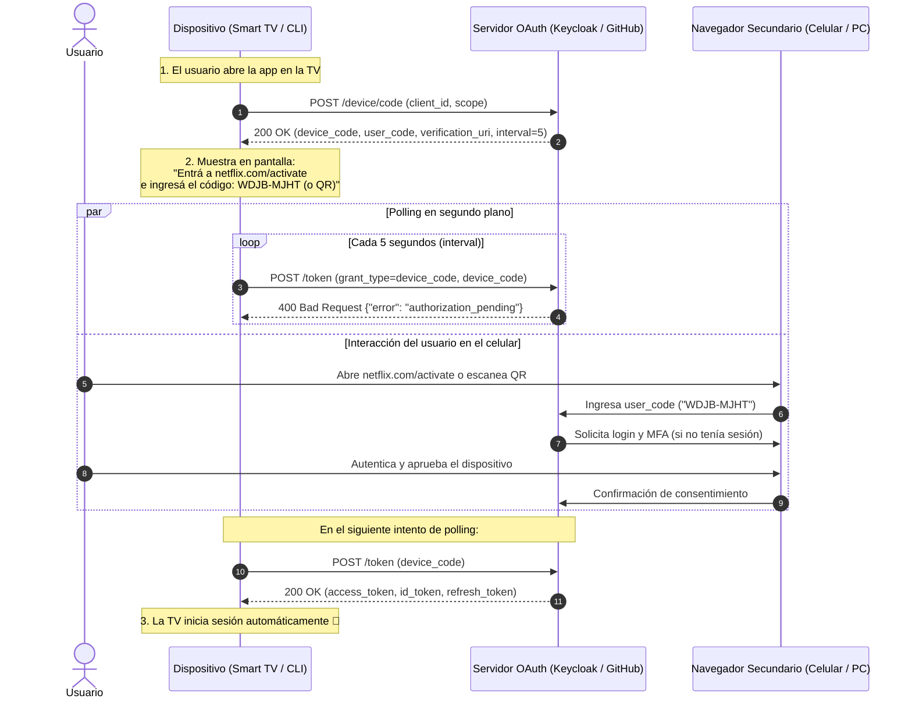

# Protocolo OAuth 2.0: Device Authorization Grant (Device Flow - RFC 8628)
**Rama:** [[Hub_IAEW|IAEW]]  
**Tags:** #materia/iaew #seguridad #oauth2 #oidc #device-grant #smart-tv #cli #iot #keycloak  
**Fecha:** 2026-09-17  
**Categoría:** Seguridad e Identidad Digital  

---

## 📺 1. ¿Qué es el Device Authorization Grant?

El **Device Authorization Grant** (especificado en el **RFC 8628** y conocido popularmente como **Device Flow**) es un flujo de autorización de OAuth 2.0 diseñado específicamente para:

1. **Dispositivos con entrada de texto limitada (*Input-Constrained Devices*):**
   * **Smart TVs y reproductores multimedia:** Netflix, YouTube, Prime Video, Apple TV, Chromecast.
   * **Consolas de videojuegos:** PlayStation, Xbox, Nintendo Switch.
2. **Dispositivos sin navegador web integrado (*No-Browser Devices*):**
   * **Herramientas de línea de comandos (CLI):** GitHub CLI (`gh auth login`), AWS CLI, Google Cloud CLI (`gcloud auth`), Stripe CLI, Heroku.
   * **Dispositivos IoT y embebidos:** Parlantes inteligentes (Alexa, Google Home), termostatos, impresoras o terminales de pago.

---

## ❓ 2. ¿Qué problema resuelve?

* **UX intolerable con control remoto:** Escribir un correo y una contraseña segura de 16 caracteres usando las flechas de un control remoto en un teclado virtual en pantalla es una experiencia frustrante y lenta.
* **Inseguridad visual (Shoulder Surfing):** Escribir credenciales en la pantalla de una Smart TV (por ejemplo, en un hotel o sala de espera) expone la contraseña a cualquiera que esté mirando.
* **Incompatibilidad con MFA/Passkeys:** La Smart TV o una terminal de Linux no pueden interactuar fácilmente con llaves FIDO2/WebAuthn, autenticadores TOTP ni escaneo biométrico.
* **La Solución:** El dispositivo **delega la autenticación a un segundo dispositivo** (celular, tablet o notebook) donde el usuario ya tiene sesión iniciada, teclado cómodo y biometría.

---

## 🔄 3. Diagrama de Secuencia del Flujo (RFC 8628)



---

## ⚙️ 4. Paso a Paso a Nivel de Protocolo HTTP

### Paso 1: El Dispositivo solicita los Códigos
El dispositivo envía una petición al `device_authorization_endpoint`:

```http
POST /protocol/openid-connect/auth/device HTTP/1.1
Host: keycloak.example.com
Content-Type: application/x-www-form-urlencoded

client_id=smart-tv-app&scope=openid%20profile%20email
```

### Paso 2: El IdP responde con los Códigos
```json
{
  "device_code": "GmRhmhcxhwAzkoEqiMEg_DnyEysNkuNhszIySk9eS",
  "user_code": "WDJB-MJHT",
  "verification_uri": "https://keycloak.example.com/device",
  "verification_uri_complete": "https://keycloak.example.com/device?user_code=WDJB-MJHT",
  "expires_in": 600,
  "interval": 5
}
```
* **`device_code`:** Secreto interno de alta entropía. El dispositivo lo guarda en memoria y **nunca se lo muestra al usuario**.
* **`user_code`:** Cadena corta y legible por humanos (letras/números sin ambigüedad como `0`/`O`). Se muestra en la pantalla de la TV.
* **`verification_uri_complete`:** Generalmente se renderiza como un **código QR** en pantalla para que el usuario solo tenga que apuntar con la cámara del celular.
* **`interval`:** Cantidad mínima de segundos (ej: 5) que el dispositivo debe esperar entre cada consulta de sondeo.

---

### Paso 3: Polling del Dispositivo al Token Endpoint
El dispositivo comienza a consultar periódicamente al `token_endpoint`:

```http
POST /protocol/openid-connect/token HTTP/1.1
Host: keycloak.example.com
Content-Type: application/x-www-form-urlencoded

grant_type=urn:ietf:params:oauth:grant-type:device_code
&client_id=smart-tv-app
&device_code=GmRhmhcxhwAzkoEqiMEg_DnyEysNkuNhszIySk9eS
```

---

## 🚦 5. Códigos de Respuesta durante el Polling

| Código de Error | Estado / Causa | Acción del Dispositivo |
| :--- | :--- | :--- |
| **`authorization_pending`** | El usuario todavía no ingresó el código ni aprobó la sesión. | Seguir esperando y reintentar al cumplirse el `interval`. |
| **`slow_down`** | El dispositivo está haciendo polling demasiado rápido (violando el `interval`). | Incrementar el tiempo de espera sumando 5 segundos adicionales. |
| **`expired_token`** | Pasaron los `expires_in` (ej: 10 minutos) sin que el usuario complete la acción. | Dejar de consultar y mostrar en pantalla: *"El código expiró. Presione OK para generar uno nuevo"*. |
| **`access_denied`** | El usuario hizo clic en *"Rechazar / Cancelar"* en su teléfono. | Abortar el flujo y avisar en pantalla que la solicitud fue denegada. |
| **`HTTP 200 OK`** | El usuario aprobó exitosamente en su teléfono. | ¡Éxito! Devuelve `access_token`, `id_token` y `refresh_token`. La TV entra a la aplicación. |

---

## 🏆 6. Comparación de Flujos OAuth 2.0 / OIDC

| Flujo | RFC | Cliente Típico | Cómo se autentica el usuario |
| :--- | :--- | :--- | :--- |
| **Authorization Code + PKCE** | RFC 7636 | SPAs (React, Angular) y Apps Móviles | Redirección en el navegador del mismo dispositivo. |
| **Client Credentials** | RFC 6749 | Backend a Backend (M2M, Daemons, Workers) | Directo con `client_id` y `client_secret` (sin humano). |
| **Device Authorization** | RFC 8628 | Smart TVs, Consolas, CLIs, Dispositivos IoT | Delegado en un **segundo dispositivo** (celular/PC con navegador). |

---
*Conexiones conceptuales:*
- [[2026-08-13_obtencion_y_tipos_de_tokens|Obtención y Tipos de Tokens]]
- [[2026-08-27_oidc_flujo_pkce_authorization_code|Flujo Authorization Code con PKCE]]
- [[2026-08-13_keycloak_aim|Keycloak y Consola AIM]]
- [[2026-08-20_conclusion_y_glosario_maestro_jwt_keycloak|Glosario Maestro: JWT y Keycloak]]
