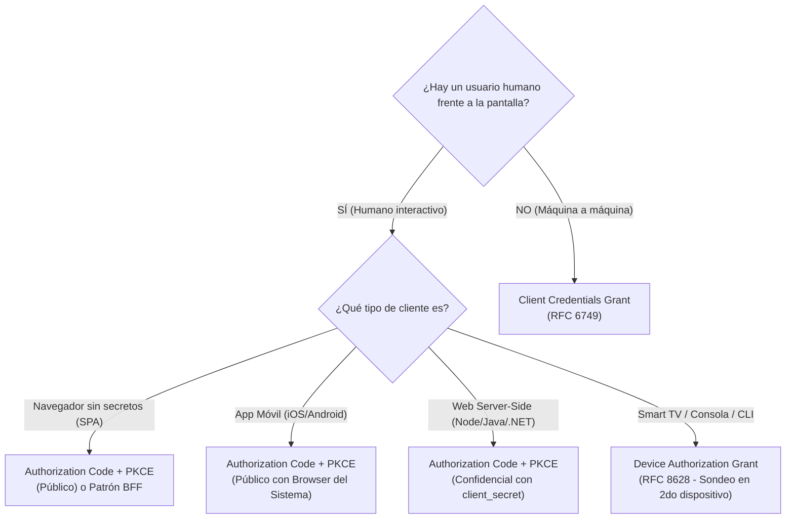

# Matriz de Flujos OAuth 2.0 y OpenID Connect: Cuándo Usar Cada Flujo
**Rama:** [[Hub_IAEW|IAEW]]  
**Tags:** #materia/iaew #seguridad #oauth2 #oidc #pkce #client-credentials #device-grant #keycloak #arquitectura  
**Fecha:** 2026-09-17  
**Categoría:** Seguridad e Identidad Digital  

---

## 🎯 1. La Pregunta Fundamental: ¿Hay Usuario Interactivo?

Para elegir el flujo correcto en cualquier diseño de sistemas o parcial, la primera pregunta arquitectónica es:



---

## 🎭 2. Autenticación (OIDC) ≠ Autorización (OAuth 2.0)

* **Autenticación (*¿Quién sos?* - OpenID Connect):**
  * El usuario inicia sesión en el Identity Provider (Keycloak / Google).
  * Emite un **`id_token`** (JWT) para la aplicación cliente con claims de identidad: `sub`, `name`, `email`, `amr`.
* **Autorización (*¿Qué podés hacer?* - OAuth 2.0):**
  * La aplicación obtiene permisos delegados para consumir APIs protegidas.
  * Emite un **`access_token`** (JWT u opaco) para el Resource Server con claims de permisos: `scope`, `roles`, `aud`.

---

## 📊 3. Matriz de Decisión Operativa

| Escenario de Negocio | Tipo de Cliente | Flujo Recomendado | Flujos Prohibidos / A Evitar |
| :--- | :--- | :--- | :--- |
| **SPA Frontend Puro** (React, Angular, Vue) | **Público** | **Authorization Code + PKCE** | ❌ `Implicit Flow` (inseguro en URL)<br/>❌ `Password Grant` (expone clave)<br/>❌ Guardar `client_secret` en JS |
| **SPA de Alta Seguridad / Banca** | **Público + Confidencial** | **Patrón BFF (Backend For Frontend)** con cookies `HttpOnly` y tokens en servidor | ❌ Guardar tokens en `localStorage` expuestos a XSS |
| **Web Server-Side Tradicional** (PHP, Java, .NET, Node SSR) | **Confidencial** | **Authorization Code + PKCE** con `client_secret` | ❌ `Password Grant` para login normal |
| **Aplicación Móvil Nativa** (iOS, Android, Flutter) | **Público** | **Authorization Code + PKCE** abriendo navegador del sistema | ❌ WebViews embebidos para pedir claves<br/>❌ Embeber `client_secret` en la APK/IPA |
| **Servicios Backend / Daemons / Cron Jobs** | **Confidencial** | **Client Credentials Grant** | ❌ Crear un usuario falso de persona con password |
| **Smart TV / Consolas / Herramientas CLI** | **Público o Confidencial** | **Device Authorization Grant** (RFC 8628) | ❌ Forzar escritura de password con control remoto |
| **Aplicación Legacy First-Party** | **Controlado** | **Password Grant** *(Solo migración transitoria)* | ❌ Convertirlo en estándar para nuevos desarrollos |

---

## ⚙️ 4. Configuración Exacta de Flags en la Consola de Keycloak

Para configurar correctamente un cliente en Keycloak según el flujo elegido:

| Flujo a Implementar | Client authentication | Standard flow | Direct access grants | Service accounts roles |
| :--- | :---: | :---: | :---: | :---: |
| **SPA con PKCE** | `OFF` | `ON` | `OFF` | `OFF` |
| **Web Backend Tradicional** | `ON` | `ON` | `OFF` | `OFF` |
| **Client Credentials (M2M)** | `ON` | `OFF` | `OFF` | `ON` |
| **Device Authorization** | Según diseño | `OFF` u opcional | `OFF` | `OFF` |
| **Password Legacy** | Según diseño | `OFF` u opcional | `ON` | `OFF` |

> [!TIP]
> **Ajustes adicionales obligatorios en Keycloak:**
> * **`Valid redirect URIs`:** Restringir con URL exactas (ej. `http://localhost:4200/*`) para mitigar ataques Open Redirector.
> * **`Web Origins`:** Declarar el origen exacto (ej. `http://localhost:4200`) para emitir los encabezados CORS en clientes SPA.
> * **`PKCE Code Challenge Method`:** Forzar a `S256` en las políticas del cliente.

---

## 🔄 5. Ciclo de Vida de Sesiones: El Rol del Refresh Token

* **Objetivo:** Permite obtener un nuevo `access_token` cuando el actual expira, sin volver a pedir credenciales al usuario.
* **Petición:**
  ```http
  POST /protocol/openid-connect/token
  grant_type=refresh_token
  &client_id=mi-cliente
  &refresh_token=REFRESH_TOKEN_ACTUAL
  ```
* **Buenas prácticas recomendadas:**
  1. **Access Tokens de vida corta:** Configurar duración de 5 a 15 minutos para minimizar la ventana de exposición.
  2. **Refresh Token Rotation (RTR):** Cada vez que se usa un refresh token, el IdP invalida el anterior y emite uno nuevo.
  3. **Detección de Reutilización:** Si un atacante roba un refresh token y el cliente legítimo intenta usarlo después, el IdP invalida toda la cadena de sesiones de ese usuario inmediatamente.

---

## 📝 6. Resolución de Casos Prácticos de Cátedra

### Caso 1: Portal de Alumnos Web (Autogestión / SYSACAD)
* **Flujo:** `Authorization Code + PKCE`.
* **Cliente:** Público (si es SPA) o Confidencial (si tiene backend SSR).
* **Justificación:** Hay un usuario humano de carne y hueso, se debe permitir MFA y SSO institucional.
* **Riesgo de otro flujo:** Si se usara Password Grant, el portal tendría que capturar la clave del alumno, rompiendo la delegación y el soporte de 2FA.

### Caso 2: Proceso Nocturno de Sincronización de Padrones
* **Flujo:** `Client Credentials Grant`.
* **Cliente:** Confidencial (`client_id` y `client_secret`).
* **Justificación:** Es un job desatendido sin interfaz gráfica ni usuario presente; el sistema actúa en nombre de su propia identidad técnica.
* **Riesgo de otro flujo:** Usar un usuario genérico con password obliga a almacenar contraseñas de personas en archivos de configuración planos.

### Caso 3: App Móvil Bancaria con Biometría
* **Flujo:** `Authorization Code + PKCE` con navegador seguro del sistema.
* **Cliente:** Público.
* **Justificación:** Las apps móviles son clientes públicos donde una clave estática puede ser descompilada con facilidad. El navegador del sistema comparte cookies de sesión con el IdP y soporta biometría/Passkeys.
* **Riesgo de otro flujo:** Usar WebViews embebidos expone al usuario a ataques de phishing interno donde la app espía los eventos de teclado.

### Caso 4: Terminal de Depósito con Teclado Numérico Limitado
* **Flujo:** `Device Authorization Grant` (RFC 8628).
* **Cliente:** Público.
* **Justificación:** El operario escanea un código QR o ingresa un código de 8 letras desde su celular corporativo y aprueba el inicio de sesión de la terminal sin tipear credenciales complejas en el teclado numérico.

---

## 🏆 Reglas de Oro para Exámenes:
* ✓ **Usuarios interactivos:** Siempre `Authorization Code + PKCE`.
* ✓ **Máquina a máquina:** Siempre `Client Credentials`.
* ✓ **Mobile y SPA:** Siempre clientes públicos sin secretos fijos.
* ✗ **Nunca usar `Implicit Flow`:** Prohibido por OAuth 2.1 (expone tokens en la URL).
* ✗ **Nunca usar `Password Grant`:** Salvo entornos legacy transitorios muy controlados.
* ✗ **Nunca guardar `client_secret` en JavaScript o aplicaciones móviles**.

---
*Conexiones conceptuales:*
- [[2026-08-27_oidc_flujo_pkce_authorization_code|Flujo Authorization Code con PKCE]]
- [[2026-09-17_oauth2_device_authorization_grant|Device Authorization Grant (Smart TVs y CLIs)]]
- [[2026-09-17_validacion_local_jwks_vs_introspect|Validación Local JWKS vs. Introspección]]
- [[2026-08-10_patron_bff_backend_for_frontend|Patrón BFF (Backend For Frontend)]]
