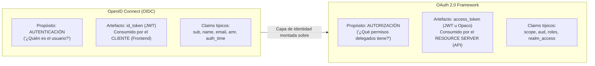

# Resumen Maestro: Seguridad OIDC, Flujos OAuth 2.0, Validación de Tokens y Resiliencia de Integraciones

**Rama:** [[Hub_IAEW|IAEW]]  
**Tags:** #materia/iaew #seguridad #oauth2 #oidc #keycloak #jwks #introspect #resiliencia #rabbitmq #idempotencia #parcial #arquitectura  
**Fecha:** 2026-09-17  
**Categoría:** Compendio General de la Cátedra  

---

## 🧭 Índice Temático

1. [[#1. Dicotomía Fundamental: Autenticación (OIDC) vs. Autorización (OAuth 2.0)|Autenticación (OIDC) vs. Autorización (OAuth 2.0)]]
2. [[#2. Matriz de Flujos OAuth 2.0 / OIDC: Cuándo Usar Cada Uno|Matriz de Flujos OAuth 2.0 / OIDC]]
3. [[#3. Guía de Configuración de Clientes en Keycloak (Explicación de Flags)|Configuración de Clientes en Keycloak (Flags)]]
4. [[#4. Validación Criptográfica de Tokens: Local (JWKS) vs. Introspección Remota (/introspect)|Validación Local (JWKS) vs. Remota (/introspect)]]
5. [[#5. Patrón BFF (Backend-For-Frontend) y Manejo Seguro de Tokens|Patrón BFF y Manejo Seguro de Tokens]]
6. [[#6. Resiliencia de Integraciones, Idempotencia y Manejo de Fallas|Resiliencia, Idempotencia y Manejo de Fallas]]
7. [[#7. Catálogo de Herramientas, Métodos y Tecnologías|Catálogo de Herramientas y Métodos]]
8. [[#8. Preguntas Clave y Trampas Frecuentes de Examen|Banco de Preguntas para Examen]]

---

## 1. Dicotomía Fundamental: Autenticación (OIDC) vs. Autorización (OAuth 2.0)

Uno de los conceptos centrales de la materia es distinguir con precisión **quién sos** de **qué podés hacer**:

### Reglas Clave:
- **`id_token`:** Diseñado para que el frontend reconozca al usuario (*"Hola, Martín"*). **Nunca debe enviarse en el header `Authorization: Bearer` a una API.**
- **`access_token`:** Credencial de acceso delegada para el *Resource Server* (API). El frontend simplemente lo transporta; la API lo valida.
- **`refresh_token`:** Credencial de larga duración utilizada contra `/token` para rotar credenciales sin pedir nuevamente usuario y contraseña.

---

## 2. Matriz de Flujos OAuth 2.0 / OIDC: Cuándo Usar Cada Uno

### Árbol de Decisión Rápido:
1. **¿Hay un usuario humano interactivo?**
   - **NO (Máquina a máquina / Daemons / Microservicios):** $\rightarrow$ **Client Credentials Grant** (RFC 6749).
   - **SÍ:** ¿Qué tipo de cliente es?
     - **Dispositivo con entrada limitada (Smart TV, Consola, CLI):** $\rightarrow$ **Device Authorization Grant** (RFC 8628).
     - **SPA (React, Vue, Angular) o Móvil (iOS, Android):** $\rightarrow$ **Authorization Code con PKCE** (Cliente Público).
     - **Web Tradicional con backend seguro (Node SSR, Spring Boot, .NET):** $\rightarrow$ **Authorization Code con PKCE y `client_secret`** (Cliente Confidencial).
     - **Sistema Legacy First-Party empresarial:** $\rightarrow$ **Password Grant (ROPC)** *(Solo migración, prohibido en nuevos sistemas por OAuth 2.1)*.

---

### Matriz Comparativa Completa con Casos Reales

| Escenario Arquitectónico | Flujo Recomendado | Tipo de Cliente | Flags en Keycloak | Ejemplo de la Vida Cotidiana |
| :--- | :--- | :--- | :--- | :--- |
| **SPA (Single Page Application)** React/Vue que corre en el navegador del usuario. Sin backend intermedio que oculte claves. | **Authorization Code + PKCE** (RFC 7636) | **Público** | • `Client auth: OFF` • `Standard flow: ON` • `Direct access: OFF` | **VS Code Web (`vscode.dev`) con GitHub.** La SPA genera un `code_verifier` en memoria y canjea el `code` sin guardar ninguna clave secreta fija. |
| **Web Server-Side Tradicional** Backend privado (Spring Boot, Node.js, ASP.NET) con base de datos y entorno seguro. | **Authorization Code + PKCE con Secret** | **Confidencial** | • `Client auth: ON` • `Standard flow: ON` • `Direct access: OFF` | **Tiendanube conectando Mercado Pago.** Tiendanube redirige al usuario a MP, recibe un `code` en su servidor y lo canjea por canal privado usando su `client_secret` corporativo. |
| **Aplicación Móvil Nativa** Instalada en Android/iOS. Se puede descompilar; no puede proteger secretos. | **Authorization Code + PKCE (Navegador del Sistema)** | **Público** | • `Client auth: OFF` • `Standard flow: ON` • `Direct access: OFF` | **Duolingo en el celular.** Al elegir *"Iniciar sesión con Google"*, abre una pestaña segura de Chrome (*Custom Tabs*), reutiliza la sesión con huella y devuelve el `code` a la app por deep-link (`duolingo://callback`). |
| **Máquina a Máquina (M2M)** Servicios backend, microservicios, pipelines CI/CD. Sin personas frente a pantallas. | **Client Credentials Grant** (RFC 6749) | **Confidencial** | • `Client auth: ON` • `Standard flow: OFF` • `Service accounts: ON` | **Bot de Discord o GitHub Actions.** Corre en un servidor desatendido. Llama directo a `POST /token` con su `client_id` y `client_secret` técnico para obtener permisos de máquina. |
| **Dispositivos Limitados / Sin Navegador** Smart TVs, consolas, consolas de comandos (CLI). Tipear es incómodo o imposible. | **Device Authorization Grant** (RFC 8628) | **Público o Confidencial** | • `OAuth 2.0 Device Grant: ON` • `Standard flow: OFF` • `Direct access: OFF` | **GitHub CLI (`gh auth login`) o Netflix en Smart TV.** La terminal muestra un código corto (`ABCD-1234`) y hace polling al servidor. El usuario aprueba cómodamente desde su celular o PC. |
| **Aplicación Legacy First-Party** Sistemas antiguos monolíticos que piden user/password en cajas de texto de escritorio. | **Resource Owner Password Credentials (ROPC)** | **Controlado** *(Deprecado en OAuth 2.1)* | • `Direct access: ON` • `Standard flow: OFF` | **Aplicativos SIAP de AFIP o cajas viejas de Coto.** Piden usuario y clave en ventanitas grises de Windows. La app maneja la contraseña del usuario en memoria, impidiendo biometría o MFA. |

---

### Funcionamiento de PKCE (Proof Key for Code Exchange - RFC 7636)
1. **Generación:** El cliente genera un valor aleatorio de alta entropía (`code_verifier`).
2. **Transformación:** Calcula `code_challenge = BASE64URL(SHA256(code_verifier))`.
3. **Petición `/auth`:** Envía `code_challenge` y `code_challenge_method=S256`. Keycloak guarda el desafío.
4. **Canje `/token`:** Al recibir el `code`, el cliente envía el `code_verifier` original en texto plano.
5. **Verificación:** Keycloak aplica SHA-256 al `code_verifier` recibido y comprueba si coincide con el `code_challenge` previo. Si un atacante intercepta el `code` en la red o en el historial del navegador, no podrá canjearlo porque no tiene el `code_verifier`.

---

## 3. Guía de Configuración de Clientes en Keycloak (Explicación de Flags)

| Flag en Keycloak | Significado Técnico | Cuándo activarlo (`ON`) | Cuándo apagarlo (`OFF`) |
| :--- | :--- | :--- | :--- |
| **`Client authentication`** | Define si el cliente es **Confidencial** (posee `client_secret`) o **Público** (sin credenciales fijas). | Servidores backend, APIs, apps web con servidor propio. | SPAs (React/Angular) y apps móviles nativas. |
| **`Standard flow`** | Habilita el flujo interactivo **Authorization Code** con redirección web al login. | Aplicaciones donde un usuario humano debe iniciar sesión en pantalla. | Integraciones máquina a máquina (M2M) o daemons. |
| **`Direct access grants`** | Habilita el flujo obsoleto **Password Grant (ROPC)** (`username` y `password` directos en POST). | **Únicamente** en migraciones de software heredado propio (*first-party*). | **Siempre en desarrollos modernos.** Prohibido en OAuth 2.1. |
| **`Service accounts roles`** | Convierte al cliente en una entidad autónoma con roles propios para **Client Credentials**. | Microservicios, bots, cron jobs desatendidos. | Aplicaciones frontend donde los permisos pertenecen a usuarios humanos. |
| **`OAuth 2.0 Device Authorization Grant`** | Habilita los endpoints `/device` para emitir pares de códigos y permitir sondeo (*polling*). | Terminales CLI, Smart TVs, dispositivos IoT sin navegador web. | Aplicaciones web estándar y móviles comunes. |

---

## 4. Validación Criptográfica de Tokens: Local (JWKS) vs. Introspección Remota (/introspect)

```mermaid
flowchart TD
    subgraph LocalJWKS["Validación Local con JWKS (Offline / Desacoplada)"]
        L1["API descarga JWKS una vez y cachea claves públicas"] --> L2["Verifica firma matemática con 'jose' (0 ms de red)"]
        L2 --> L3["Verifica claims estrictos: iss, aud, exp, nbf, alg"]
        L3 --> L4["Ventajas: Rendimiento altísimo, tolerancia a caídas del IdP"]
        L4 --> L5["Desventaja: No detecta revocaciones inmediatas antes de 'exp'"]
    end

    subgraph RemoteIntro["Introspección Remota: POST /token/introspect (RFC 7662)"]
        R1["API llama por red al IdP en cada petición HTTP"] --> R2["Envía token + client_secret confidencial"]
        R2 --> R3["IdP responde { active: true/false, ... } en tiempo real"]
        R3 --> R4["Ventajas: Revocación en tiempo real, soporta tokens opacos"]
        R4 --> R5["Desventajas: Latencia de red extra, IdP es cuello de botella y SPOF"]
    end
```

### Matriz Comparativa

| Criterio | Validación Local (JWKS) | Introspección Remota (`/introspect`) |
| :--- | :--- | :--- |
| **Estándar RFC** | RFC 7517 (JWK / JWKS) | RFC 7662 (Token Introspection) |
| **Tipo de Token** | **JWT estructurado** firmado asimétricamente. | Tokens JWT o **Tokens Opacos** (cadenas aleatorias sin claims visibles). |
| **Latencia de Red** | **0 ms** (Claves públicas cacheadas en memoria local). | **50 - 200 ms** (Llamada HTTP adicional al IdP por cada request). |
| **Escalabilidad** | Ilimitada (No sobrecarga al servidor de identidad). | Limitada (El IdP se vuelve cuello de botella y SPOF). |
| **Tolerancia a Caídas** | Alta (La API sigue operando si Keycloak se cae). | Nula (Si Keycloak no responde, la API se bloquea). |
| **Revocación Inmediata** | **No:** El token sigue siendo válido hasta que alcance su `exp`. | **Sí:** Si el usuario fue bloqueado en Keycloak, responde `active: false`. |
| **Requisitos del Cliente** | Ninguno (El endpoint JWKS es público). | La API debe ser un **Cliente Confidencial** con `client_secret`. |

---

### Claims Mínimos Obligatorios al Validar Localmente con JWKS:
1. **`alg`:** Exigir explícitamente `RS256` (prohibir `none` o algoritmos simétricos no esperados).
2. **`iss`:** Coincidencia exacta con la URL del Realm de Keycloak.
3. **`aud` (Audience):** **Validación crítica.** Asegura que el token fue emitido específicamente para esta API. Si no se valida `aud`, un token de baja seguridad podría ser reutilizado indebidamente en endpoints críticos.
4. **`exp` y `nbf`:** Validar vigencia temporal.

---

## 5. Patrón BFF (Backend-For-Frontend) y Manejo Seguro de Tokens

- **Problema en SPAs:** Guardar tokens en `localStorage` o `sessionStorage` deja las credenciales expuestas a robo total mediante **XSS** (*Cross-Site Scripting*).
- **Solución con BFF:**
  - El frontend interactúa únicamente con su backend dedicado (BFF) mediante **Cookies de Sesión seguras** (`HttpOnly`, `Secure`, `SameSite=Strict`).
  - El JavaScript del navegador jamás tiene acceso a los tokens OAuth.
  - El BFF almacena el `access_token` y `refresh_token` en su memoria segura del servidor o en un almacén privado (ej. Redis).
  - Al reenviar peticiones hacia los microservicios internos, el BFF inyecta el `Authorization: Bearer <access_token>`.

---

## 6. Resiliencia de Integraciones, Idempotencia y Manejo de Fallas

En integraciones distribuidas, los timeouts de red son ambiguos: un cliente no sabe si su petición no llegó o si el servidor la ejecutó y falló al responder.

### 6.1. Idempotencia en APIs HTTP (`Idempotency-Key`)
- El cliente envía un header `Idempotency-Key: <UUIDv4>` en operaciones de creación (`POST`).
- **Primer intento:** Se procesa la orden, se persiste en la BD y se guarda la clave con estado `COMPLETED` y el resultado obtenido.
- **Reintento legítimo (mismo payload):** Se devuelve la respuesta almacenada con `200 OK` (*Replay transparente*), evitando duplicar transacciones.
- **Uso indebido (distinto payload para la misma clave):** Se responde con `409 Conflict`.

### 6.2. La Frontera: `Idempotency-Key` (HTTP) vs. `eventId` (Mensajería)
- **`Idempotency-Key`:** Ámbito externo (Cliente $\rightarrow$ API REST). Representa la **intención** de crear algo.
- **`eventId`:** Ámbito interno (API $\rightarrow$ RabbitMQ $\rightarrow$ Worker). Representa un **hecho inmutable consumado** (`pedido.confirmado`).
- **Regla:** No son intercambiables. El Worker deduplica registrando el `eventId` en una colección `EventoProcesado` con índice único.

### 6.3. Estrategia de Reintentos en RabbitMQ: Anti-patrón de `nack(requeue=true)`
- Hacer `nack` con `requeue=true` ante un error genera un bucle infinito a 100% de CPU.
- **Topología Resiliente:**
  - Los mensajes con fallas transitorias se publican a un exchange de reintento (`pedidos.retry`) con TTL (`x-message-ttl: 10000ms`).
  - Al vencer el TTL, RabbitMQ envía automáticamente el mensaje de regreso al exchange principal mediante Dead Lettering (`x-dead-letter-exchange`).
  - Al superar `MAX_RETRIES` (ej. 3 intentos), el worker enruta el mensaje a la cola de descarte final (`pedidos.dlq`) para análisis y resolución manual.

---

## 7. Catálogo de Herramientas, Métodos y Tecnologías

| Herramienta / Tecnología | Rol en la Cátedra | Métodos y Conceptos Clave |
| :--- | :--- | :--- |
| **Keycloak (AIM)** | Servidor central de Identidad y Autorización. | Gestión de Realms, Clients, Scopes y Roles; endpoints `/auth`, `/token`, `/certs` (JWKS) y `/introspect`. |
| **Librería `jose` (Node.js)** | Validación criptográfica de tokens JWT. | `createRemoteJWKSet` (caché automático de claves públicas) y `jwtVerify` (validación de firma y claims `iss`/`aud`). |
| **Web Crypto API** | Criptografía en el navegador para PKCE. | `crypto.getRandomValues` para `code_verifier` y `crypto.subtle.digest('SHA-256')` para `code_challenge`. |
| **Postman** | Suite de pruebas de integración de APIs. | Automatización de flujos OAuth 2.0, scripts pre-solicitud (generación de GUIDs), variables de entorno y aserciones funcionales (`pm.test`). |
| **RabbitMQ** | Broker de mensajería asíncrona desacoplada. | Exchanges (`direct`, `topic`), bindings, queues con TTL (`x-message-ttl`), DLQ (`x-dead-letter-exchange`), `ack` y `nack`. |
| **MongoDB & Mongoose** | Base de datos documental con persistencia. | Índices únicos compuestos (`unique: true`), esquemas de idempotencia y deduplicación con colección `EventoProcesado`. |
| **Docker Compose** | Entorno de desarrollo contenedorizado. | Orquestación de contenedores para MongoDB (`mongo:6`) y RabbitMQ con interfaz web (`rabbitmq:3-management`). |

---

## 8. Preguntas Clave y Trampas Frecuentes de Examen

1. **¿Por qué una SPA no debe tener `client_secret`?**  
   Porque todo código que corre en el navegador del cliente es accesible mediante las herramientas de desarrollo (F12) o inspección de memoria. Cualquier secreto hardcodeado en una SPA es inmediatamente de dominio público.
2. **¿Por qué es un error grave no verificar el claim `aud` en la validación local con JWKS?**  
   Porque permite ataques de suplantación de audiencia (*confused deputy*): un token legítimo emitido para un servicio de bajo privilegio puede ser reutilizado en APIs críticas de la misma empresa si ambas pertenecen al mismo Realm de Keycloak.
3. **¿Por qué está deprecado el flujo Password Grant (ROPC) en OAuth 2.1?**  
   Porque la aplicación cliente captura las credenciales del usuario en texto plano, impidiendo la autenticación multifactor (MFA), llaves biométricas y violando el principio de delegación segura de OAuth.
4. **¿Por qué un consumidor de RabbitMQ necesita deduplicar mensajes si la API ya implementó `Idempotency-Key`?**  
   Porque el protocolo de mensajería AMQP opera bajo garantía de entrega *at-least-once*. Si la conexión de red cae justo después de procesar el mensaje pero antes de que el `ack` llegue al broker, RabbitMQ reentregará el mensaje a otro consumidor. El consumidor debe protegerse registrando el `eventId` con un índice único en su base de datos.

---

## 🔗 Enlaces y Notas Relacionadas
- [[Hub_IAEW|Hub Principal IAEW]]
- [[2026-09-17_casos_reales_flujos_oauth2_keycloak|Casos Reales y Cotidianos de Flujos OAuth 2.0 / Keycloak]]
- [[2026-09-17_oauth2_oidc_matriz_flujos_y_arquitectura|Matriz de Flujos OAuth 2.0 y OIDC: Cuándo Usar Cada Flujo]]
- [[2026-09-17_validacion_local_jwks_vs_introspect|Seguridad en APIs: Validación Local con JWKS vs. Introspección Remota (/introspect)]]
- [[2026-09-17_oauth2_device_authorization_grant|OAuth 2.0: Device Authorization Grant]]
- [[2026-08-10_patron_bff_backend_for_frontend|Patrón BFF (Backend For Frontend)]]
- [[2026-09-17_actividad_clase_05_resiliencia_idempotencia_retry_dlq|Clase 05 (E-commerce): Resiliencia de Integraciones, Idempotencia y DLQ]]
