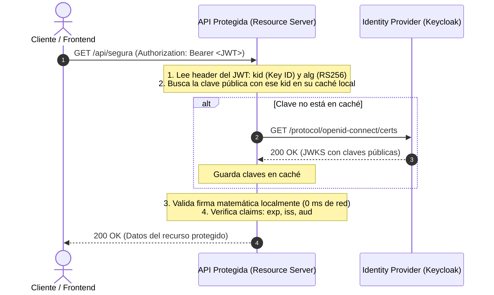

# Seguridad en APIs: Validación Local con JWKS vs. Introspección Remota (/introspect)
**Rama:** [[Hub_IAEW|IAEW]]  
**Tags:** #materia/iaew #seguridad #jwt #jwks #introspect #oauth2 #oidc #keycloak #apis #arquitectura  
**Fecha:** 2026-09-17  
**Categoría:** Seguridad y Autenticación Web  

---

## 🎯 1. La Idea Central

| Enfoque | ¿Qué demuestra? | Pregunta que responde |
| :--- | :--- | :--- |
| **Validación Local (JWKS)** | **Firma e Integridad:** Demuestra criptográficamente que el token fue emitido por el IdP esperado, no fue alterado y cumple los claims temporales. | *"¿Este token fue firmado legítimamente por mi IdP y no está vencido?"* |
| **Introspección Remota (`/introspect`)** | **Estado y Actividad:** Consulta en tiempo real al Identity Provider si el token sigue activo o fue revocado. | *"¿El IdP reconoce que este token sigue vivo ahora mismo en su base de sesiones?"* |

> [!IMPORTANT]
> **Firma válida no equivale a token activo ni a permiso suficiente:**  
> Un JWT puede tener una firma matemáticamente perfecta y no haber vencido (`exp`), pero el usuario pudo haber cerrado sesión, cambiado su contraseña o sido dado de baja en LDAP hace 10 segundos.

---

## 🔍 2. ¿Qué se Valida en un Access Token?

1. **Firma criptográfica:** Integridad del mensaje y emisor mediante clave pública del IdP.
2. **Claims de protocolo (Mínimos obligatorios):**
   * `exp` (Expiration Time): El token no debe estar expirado.
   * `nbf` (Not Before): El token ya es válido en el tiempo.
   * `iss` (Issuer): Debe coincidir exactamente con la URL del Realm del IdP (ej. `https://labsys.frc.utn.edu.ar/aim/realms/dds-materia`).
   * `aud` (Audience): **Crítico**. Debe indicar que el token fue emitido para **esta API en particular** (ej. `api-transferencias`). Si se omite, un token emitido para otra API de la empresa podría ser aceptado indebidamente.
   * `alg`: Algoritmo permitido (ej. `RS256`). Se debe rechazar explícitamente algoritmos no esperados como `none` o claves simétricas no autorizadas.
3. **Validaciones de negocio:** Scopes requeridos (`confirm:pedidos`), roles (`realm_access.roles`), tenant o permisos específicos.

---

## ⚙️ 3. Flujo de Validación Local con JWKS (Offline)

JWKS (*JSON Web Key Set*, RFC 7517) es el conjunto público de claves criptográficas que publica el IdP en su endpoint de certificados:
* **Discovery:** `GET /.well-known/openid-configuration` $\rightarrow$ extrae campo `jwks_uri` (ej. `.../protocol/openid-connect/certs`).



### Implementación en Node.js (Librería `jose`):
```javascript
import { createRemoteJWKSet, jwtVerify } from 'jose';

const issuer = 'https://labsys.frc.utn.edu.ar/aim/realms/dds-materia';
const audience = 'mi-api-ecommerce';

// Cachea automáticamente las claves y las refresca si entra un nuevo kid
const jwks = createRemoteJWKSet(new URL(`${issuer}/protocol/openid-connect/certs`));

export async function validarTokenLocalmente(accessToken) {
  const { payload, protectedHeader } = await jwtVerify(accessToken, jwks, {
    issuer,
    audience,
    algorithms: ['RS256']
  });

  return {
    valido: true,
    header: protectedHeader,
    claims: payload
  };
}
```

---

## 📡 4. Flujo de Introspección Remota (`/introspect` - RFC 7662)

La API no valida localmente; delega la decisión en cada request haciendo un POST hacia el servidor de identidad.

```bash
curl --location 'https://labsys.frc.utn.edu.ar/aim/realms/dds-materia/protocol/openid-connect/token/introspect' \
--header 'Content-Type: application/x-www-form-urlencoded' \
--data-urlencode 'client_id=CLIENTE_CONFIDENCIAL' \
--data-urlencode 'client_secret=CLIENT_SECRET' \
--data-urlencode 'token=ACCESS_TOKEN'
```

### Respuesta del IdP:
```json
{
  "active": true,
  "sub": "1503c1fb-0d2b-4956-94c9-a68eb82642fc",
  "client_id": "mi-app",
  "username": "usuario",
  "scope": "openid profile email",
  "exp": 1730000000
}
```
*(Si el token fue revocado o expiró, devuelve simplemente `{"active": false}`)*.

---

## ⚖️ 5. Comparativa Exhaustiva: JWKS Local vs. Introspect

| Criterio | Validación Local con JWKS | Introspección Remota (`/introspect`) |
| :--- | :--- | :--- |
| **Dependencia del IdP** | **Mínima:** No depende del IdP en cada request; solo consulta para descargar/refrescar claves públicas. | **Total:** Requiere llamada de red hacia el IdP en cada validación. |
| **Latencia de Red** | **Ultra-baja (0 ms):** Verificación matemática en memoria RAM de la API. | **Alta (+50 a 200 ms):** Suma el viaje HTTP de ida y vuelta al IdP por cada request de usuario. |
| **Revocación Inmediata** | **No la detecta:** Confía ciegamente en el tiempo de expiración (`exp`) del token. | **Inmediata:** Detecta al instante bajas de usuario, cierres de sesión central o cambios de permisos. |
| **Tokens Opacos** | **No sirve:** Solo puede validar tokens estructurados con firma (JWT). | **Sí sirve:** Es el único método para validar tokens de referencia opacos (cadenas aleatorias). |
| **Escalabilidad** | **Excelente:** Ideal para microservicios y APIs con miles de peticiones por segundo. | **Limitada:** Puede saturar al IdP (*thundering herd*) y convertirse en cuello de botella. |
| **Secreto de Cliente** | **No requiere:** Solo consume claves públicas del IdP. | **Requiere Cliente Confidencial:** Necesita `client_secret` para llamar al endpoint. |

---

## 🔀 6. Patrón Arquitectónico Mixto (El Enfoque Recomendado)

En sistemas de misión crítica se combinan ambos patrones para equilibrar rendimiento y seguridad:

```
Request entrante ──> [ 1. Validar Firma Local con JWKS + Claims ] (Rápido, 99% de los casos)
                                   │
                                   ▼
                   ¿Es operación sensible / alto riesgo?
                   (ej: transferencias bancarias, cambio de clave, usuario con alerta)
                                   │
                      ┌────────────┴────────────┐
                     SÍ                         NO
                      │                          │
                      ▼                          ▼
           [ 2. Llamar a /introspect ]       Permitir Acceso
```

---

## 🚨 7. Diagnóstico Rápido de Errores de Validación

| Error detectado | Causa probable | Corrección en la API / IdP |
| :--- | :--- | :--- |
| **`JWT expired`** | El `exp` del token quedó en el pasado. | Solicitar refresco con `refresh_token` o iniciar nuevo login. |
| **`unexpected iss`** | El `iss` del token no coincide con el Realm configurado. | Verificar la URL base del Realm en variables de entorno. |
| **`unexpected aud`** | El token no fue emitido para esta API. | Configurar el *Audience Mapper* en Keycloak o corregir la audiencia esperada. |
| **`no applicable key`** | El `kid` del header no está en el JWKS en caché. | Forzar refresco de claves contra el IdP o soportar rotación de claves. |
| **`active: false`** | Token revocado, modificado, expirado o cliente no autorizado. | Reautenticar al usuario o revisar credenciales del cliente de introspección. |

---

## 🛡️ Reglas de Oro de Seguridad en APIs:
* ✅ **Para JWTs:** Utilizar validación local con JWKS como base de la arquitectura.
* ✅ **Validar siempre `iss`, `aud` y `exp`:** Nunca validar únicamente la firma.
* ✅ **Cachear claves públicas con tolerancia a rotación:** Si llega un `kid` nuevo, refrescar el JWKS sin reiniciar el servidor.
* ❌ **Nunca confiar solo en decodificar el payload (`jwt.decode`):** Cualquiera puede alterar un payload si la firma no se valida criptográficamente.
* ❌ **Nunca llamar a `/introspect` desde un frontend público (SPA/Móvil):** Requiere un secreto de cliente que no debe exponerse en JavaScript.

---
*Conexiones conceptuales:*
- [[2026-08-13_obtencion_y_tipos_de_tokens|Obtención y Tipos de Tokens]]
- [[2026-08-13_seguridad_y_validacion_oidc_oauth2|Seguridad y Validación OIDC / OAuth2]]
- [[2026-08-20_conclusion_y_glosario_maestro_jwt_keycloak|Glosario Maestro: JWT y Keycloak]]
- [[2026-09-17_oauth2_oidc_matriz_flujos_y_arquitectura|Matriz de Flujos OAuth 2.0 / OIDC]]
