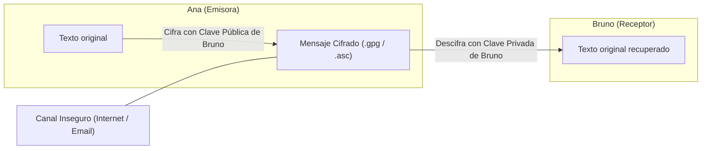

# Actividad Teórico-Práctica: Cifrado y Firma Digital con Kleopatra (OpenPGP)

**Rama:** [[Hub_IAEW|IAEW]]  
**Tags:** #materia/iaew #seguridad #criptografia #openpgp #kleopatra #firmas-digitales #laboratorio #parcial  
**Fecha:** 2026-09-25  
**Categoría:** Seguridad y Criptografía Aplicada  

---

## 🧭 Índice de la Actividad

1. [[#1. Lo que Deberías Aprender: Conceptos Fundamentales|Lo que Deberías Aprender]]
2. [[#2. Guía Paso a Paso para la Práctica y Obtención de Evidencias|Paso a Paso de las Prácticas]]
3. [[#3. Respuestas Oficiales a las Preguntas de Reflexión (Punto 12)|Respuestas a las Preguntas de Examen]]
4. [[#4. Checklist de Evidencias para Entrega|Checklist de Entrega]]

---

## 🧠 1. Lo que Deberías Aprender: Conceptos Fundamentales

### 1.1. Criptografía Simétrica vs. Asimétrica
* **Criptografía Simétrica (Secreto Compartido):** Una misma clave sirve para cifrar y descifrar (ej. AES). Su gran vulnerabilidad es el canal de distribución: si alguien intercepta la clave mientras se la pasás a la otra persona, todo el canal queda comprometido.
* **Criptografía Asimétrica (Par de Claves Pública / Privada - OpenPGP / RSA / Ed25519):** Cada participante genera un par de claves matemáticamente enlazadas:
  * **Clave Pública:** Es como un **buzón con ranura** o un candado abierto. Se distribuye libremente. Cualquiera puede meter un mensaje o cerrar el candado, pero nadie puede abrirlo.
  * **Clave Privada:** Es la **llave única** que abre ese buzón. Permanece bajo control exclusivo de su dueño, protegida por contraseña (*passphrase*).



---

### 1.2. La Trinidad Criptográfica: Cifrar vs. Firmar vs. Ambos

| Operación | Clave que usa el Emisor | Clave que usa el Receptor | Propiedad de Seguridad que Aporta |
| :--- | :--- | :--- | :--- |
| **Cifrado** | **Pública del Receptor** | **Privada del Receptor** | **Confidencialidad:** Solo el destinatario legítimo con su clave privada puede leer el contenido. |
| **Firma Digital** | **Privada del Emisor** | **Pública del Emisor** | **Autenticidad e Integridad:** Demuestra la identidad del autor (no repudio) y que el archivo no fue modificado. El archivo sigue siendo legible. |
| **Firma + Cifrado** | **Privada de Ana + Pública de Bruno** | **Privada de Bruno + Pública de Ana** | **Confidencialidad + Autenticidad + Integridad:** Máxima seguridad: secreto absoluto y autoría 100% verificada. |

---

### 1.3. ¿Qué es el Fingerprint y por qué es Vital?
* El **Fingerprint (Huella digital)** es un hash hexadecimal único (40 caracteres, ej. `A1B2 C3D4 ...`) derivado de la clave pública.
* **Ataque Man-in-the-Middle (MitM):** Si un atacante intercepta la comunicación inicial y reemplaza la clave pública de Bruno por la suya propia, Ana cifrará para el atacante sin saberlo.
* **Regla de Confianza:** El fingerprint debe compararse siempre por un **canal secundario fuera de banda** (llamada telefónica, WhatsApp, presencialmente o videollamada) antes de confiar en una clave pública recibida.

---

## 🛠️ 2. Guía Paso a Paso para la Práctica y Obtención de Evidencias

> [!TIP]
> Si hacés la práctica de forma individual, podés simular ambos participantes creando dos identidades en Kleopatra:
> * **Identidad A:** `Ana Alumna` (`ana@clase.local`)
> * **Identidad B:** `Bruno Alumno` (`bruno@clase.local`)

---

### Paso 0: Instalación de Kleopatra
1. Descargar el instalador oficial de Gpg4win desde [gpg4win.org/download.html](https://www.gpg4win.org/download.html).
2. Instalar verificando que **Kleopatra** esté marcado.
3. Abrir **Kleopatra**.

---

### Paso 1: Crear los Pares de Claves OpenPGP
1. En Kleopatra: Menú **Archivo** $\rightarrow$ **Nuevo par de claves...**
2. Elegir **Crear un par de claves OpenPGP personal**.
3. Ingresar nombre y correo:
   * Nombre: `Ana Alumna` | Correo: `ana@clase.local`
4. Definir una contraseña segura (*passphrase*) cuando lo solicite.
5. Repetir el proceso para crear la identidad de `Bruno Alumno` (`bruno@clase.local`).
6. Hacer doble clic sobre cada certificado para visualizar y registrar su **Fingerprint**.

📸 **Evidencia 1:** Captura de pantalla de Kleopatra con ambos certificados creados en la lista principal.

---

### Paso 2: Exportar e Intercambiar Claves Públicas (`.asc`)
1. Clic derecho sobre el certificado de Ana $\rightarrow$ **Exportar...**
2. Guardar como `ana-publica.asc` (formato ASCII).
3. Clic derecho sobre Bruno $\rightarrow$ **Exportar...** $\rightarrow$ `bruno-publica.asc`.
4. *(Si trabajás con un compañero, intercambian los `.asc` e importan con el botón **Importar** de Kleopatra).*

📸 **Evidencia 2:** Archivo `ana-publica.asc` generado (abierto en Bloc de Notas para ver `-----BEGIN PGP PUBLIC KEY BLOCK-----`).

---

### Paso 3: Práctica 1 — Cifrado de un Archivo
1. Crear un archivo `mensaje-para-bruno.txt`:
   ```text
   Bruno:
   Este archivo fue cifrado para vos durante la práctica de Kleopatra.
   Saludos, Ana
   ```
2. En Kleopatra, presionar el botón **Firmar/Cifrar...**
3. Seleccionar `mensaje-para-bruno.txt`.
4. En la configuración:
   * Tildar **Cifrar para otros** $\rightarrow$ Seleccionar **Bruno Alumno**.
   * Destildar la opción de firmar (solo cifrado).
5. Se generará el archivo `mensaje-para-bruno.txt.gpg`.
6. **Descifrado:** Presionar **Descifrar/Verificar...** y elegir `mensaje-para-bruno.txt.gpg`. Kleopatra usará la clave privada de Bruno (pedirá la contraseña) y recuperará el texto original.

📸 **Evidencia 3:** Captura de Kleopatra con el mensaje *"Descifrado correcto / Operación finalizada con éxito"*.

---

### Paso 4: Práctica 2 — Intercambio en Sentido Inverso
1. Crear `respuesta-para-ana.txt`.
2. Bruno cifra el archivo seleccionando la clave pública de **Ana**.
3. Ana descifra el archivo resultante con su clave privada.

---

### Paso 5: Práctica 3 — Cifrado de Texto con el Bloc de Notas de Kleopatra
1. En Kleopatra, abrir la pestaña **Bloc de notas** (*Notepad*).
2. Escribir un mensaje de texto.
3. En la pestaña inferior **Destinatarios**, marcar a **Bruno**.
4. Clic en **Cifrar el bloc de notas**.
5. Ver cómo el texto se transforma en un bloque OpenPGP:
   ```text
   -----BEGIN PGP MESSAGE-----
   ... (datos cifrados en base64) ...
   -----END PGP MESSAGE-----
   ```
6. Presionar **Descifrar/Verificar el bloc de notas** para recuperar el texto legible.

📸 **Evidencia 4:** Captura del bloque `-----BEGIN PGP MESSAGE-----` cifrado en el bloc de notas de Kleopatra.

---

### Paso 6: Práctica 4 — Firma Digital e Integridad (Tampering Test)
1. Crear un archivo `documento-firmado.txt` con el texto:
   ```text
   Autorizo la operación por un valor de $50.000. Firmado: Ana.
   ```
2. En Kleopatra, presionar **Firmar/Cifrar...**
3. Marcar **únicamente** la opción **Firmar como:** `Ana Alumna` (desmarcar cifrado).
4. **Verificación Exitosa:** Presionar **Descifrar/Verificar...** y seleccionar el archivo firmado. Kleopatra mostrará una barra verde: **"Firma válida de Ana Alumna"**.
5. **Simulación de Ataque (Tampering):**
   * Abrir el archivo de texto original y modificar el monto a `$500.000` (cambiar una sola letra o número).
   * Volver a verificar con Kleopatra.
   * Kleopatra mostrará una advertencia roja: **"Firma NO VÁLIDA / El contenido fue modificado"**.

📸 **Evidencia 5:** 
* Captura 1: Barra verde de firma válida.
* Captura 2: Barra roja de firma inválida tras modificar el archivo.

---

### Paso 7: Desafío — Firmar y Cifrar Simultáneamente
1. En Kleopatra, seleccionar un archivo y tildar **ambas opciones**:
   * **Firmar como:** `Ana Alumna` (clave privada de Ana).
   * **Cifrar para:** `Bruno Alumno` (clave pública de Bruno).
2. Al descifrar como Bruno:
   * Kleopatra descifra el contenido con la clave privada de Bruno.
   * Valida la firma e informa: *"Firma válida de Ana Alumna"*.

---

## 📝 3. Respuestas Oficiales a las Preguntas de Reflexión (Punto 12)

### 1. ¿Qué clave utiliza Ana para cifrar un archivo destinado a Bruno?
> **Respuesta:** Utiliza la **clave pública de Bruno**. De este modo, únicamente el poseedor de la clave privada correspondiente (Bruno) podrá descifrar y leer el contenido.

### 2. ¿Qué clave utiliza Bruno para descifrar ese archivo?
> **Respuesta:** Utiliza su propia **clave privada**, la cual permanece bajo su exclusivo control y protegida por su contraseña.

### 3. ¿Qué información se puede compartir libremente y cuál debe mantenerse en secreto?
> **Respuesta:** 
> * **Se comparte libremente:** La **clave pública** y el **Fingerprint** (para permitir que otros te envíen mensajes cifrados o comprueben tus firmas).
> * **Se mantiene en secreto absoluto:** La **clave privada** y su contraseña (*passphrase*). Jamás debe exportarse ni compartirse bajo ninguna circunstancia.

### 4. ¿Qué función cumple el fingerprint?
> **Respuesta:** Es un resumen hash único de la clave pública. Sirve para autenticar la identidad de la clave pública a través de un **canal fuera de banda** (llamada telefónica, WhatsApp o en persona), evitando que un atacante suplante la clave mediante un ataque *Man-in-the-Middle*.

### 5. ¿Qué diferencia existe entre cifrar y firmar?
> **Respuesta:** 
> * **Cifrar** provee **Confidencialidad**: oculta el contenido para que solo el destinatario con la clave privada pueda leerlo.
> * **Firmar** provee **Autenticidad e Integridad**: no oculta el contenido (sigue siendo legible), pero adjunta una prueba criptográfica que demuestra la autoría del emisor y que el documento no fue alterado.

### 6. ¿Por qué una firma deja de ser válida si se modifica el archivo?
> **Respuesta:** Porque la firma digital se calcula a partir del hash del contenido exacto del archivo original. Al alterar un solo carácter, el hash resultante cambia por completo y no coincide con el hash firmado por la clave privada del autor.

### 7. ¿Qué propiedad aporta realizar firma + cifrado?
> **Respuesta:** Aporta de forma simultánea **Confidencialidad** (secreto frente a terceros), **Autenticidad / No Repudio** (prueba irrefutable del emisor) e **Integridad** (seguridad de que nadie alteró el mensaje en tránsito).

### 8. ¿Qué riesgo existiría si un atacante reemplazara la clave pública de Bruno durante el intercambio?
> **Respuesta:** Se produce un ataque **Man-in-the-Middle (MitM)**. Ana cifraría el mensaje con la clave pública del atacante pensando que es de Bruno. El atacante podría interceptar el archivo, descifrarlo con su clave privada, leer o adulterar el texto, volver a cifrarlo con la clave pública real de Bruno y enviárselo sin que las partes lo detecten.

---

## 📋 4. Checklist de Evidencias para Entrega

* [ ] Archivo `.asc` que contiene únicamente la clave pública.
* [ ] Captura de Kleopatra con las identidades creadas y sus fingerprints.
* [ ] Captura de cifrado y descifrado exitoso de un archivo.
* [ ] Captura del texto cifrado en el Bloc de Notas de Kleopatra (`-----BEGIN PGP MESSAGE-----`).
* [ ] Captura de verificación exitosa de firma (barra verde) y verificación fallida tras modificar el archivo (barra roja).
* [ ] Respuestas a las 8 preguntas de reflexión.

---

## 🔗 Enlaces Relacionados
- [[Hub_IAEW|Hub Principal IAEW]]
- [[2026-08-13_seguridad_y_validacion_oidc_oauth2|Seguridad y Validación OIDC / OAuth2]]
- [[2026-09-17_validacion_local_jwks_vs_introspect|Validación Local con JWKS vs. Introspección]]
- [[2026-09-17_resumen_maestro_seguridad_oidc_resiliencia|Resumen Maestro de Seguridad IAEW]]
