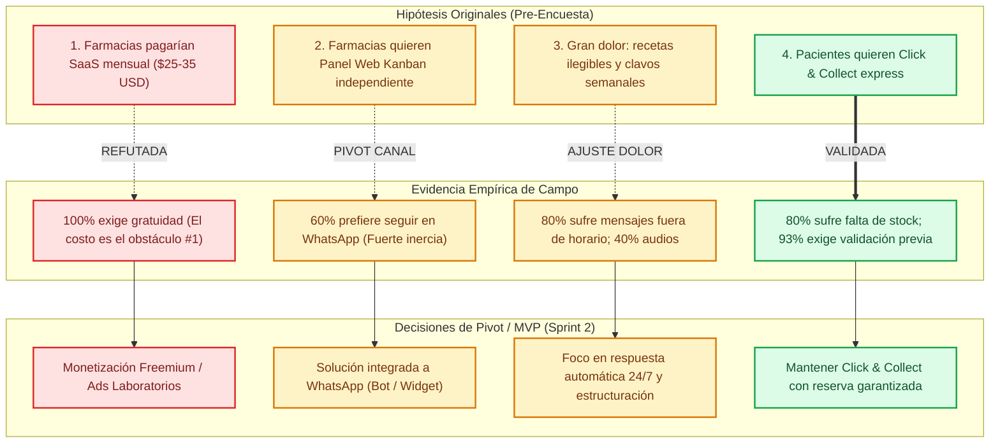

# 📊 Reporte Ejecutivo de Validación: Resultados de Encuesta FarmaLink / FastPharm

> **Sprint 2 — Emprendimientos Tecnológicos (Metodología ExO Launchpad)**  
> **Objetivo:** Validación cuantitativa y cualitativa del problema (Customer Discovery) mediante entrevistas y encuestas estructuradas a **15 Pacientes (B2C)** y relevamiento de campo real con Google Forms / Excel a **5 Farmacias Independientes de Barrio (B2B)**.

---

## 👥 1. Segmento Pacientes (B2C) — Muestra: $N = 15$

### 🖼️ Infografía de Resultados B2C ($N = 15$)

---

### 📈 Desglose Cuantitativo y Análisis de Preguntas ($N = 15$)

| Pregunta | Opción | Votos ($n$) | Porcentaje | Hallazgo Clave |
| :--- | :--- | :---: | :---: | :--- |
| **Q1. Frecuencia de compra** | • Varias veces al mes (Crónicos / Niños) • Una vez al mes • Ocasional (Urgencias) | **9** 4 2 | **60%** 27% 13% | **Alta recurrencia:** El 60% acude múltiples veces al mes; tienen alta fricción y gasto constante en farmacia. |
| **Q2. Fricciones últimos 6 meses** *(Opción múltiple)* | • No tenían stock (viaje en vano) • Más de 15 min de cola p/ consultar • Tuve que ir 2 veces (encargar y retirar) • Receta rebotada (error de datos / tope) • Ninguno / Sin problemas | **12** **10** 7 2 1 | **80%** **67%** 47% 13% 7% | **Dolor severo comprobado:** 12 de 15 pacientes perdieron tiempo por falta de stock y 10 de 15 sufrieron colas prolongadas. |
| **Q3. Experiencia por WhatsApp** | • Demoran horas o respuestas vagas • No atienden o piden ir presencial • Rápida y me reservaron todo • Nunca usó WhatsApp con farmacias | **9** 3 2 1 | **60%** 20% 13% 7% | **Falla del canal improvisado:** El 80% (12/15) tuvo mala experiencia o nula atención al intentar comunicarse por mensajería. |
| **Q4. Saber stock y precio antes** *(Escala 1 a 5)* | • 5 - Imprescindible (Ahorra viajes) • 4 - Muy útil • 3 - Útil • 1 y 2 - Poco / Nada útil | **12** 2 1 0 | **80%** 13% 7% 0% | **Deseabilidad extrema:** El 93% (14/15) considera de alto impacto validar disponibilidad y descuento antes de salir. |
| **Q5. Modalidad de entrega** | • Retiro express mostrador (Click & Collect) • Envío a domicilio (Cadete farmacia) • Indiferente | **10** 4 1 | **67%** 27% 7% | **Validación de modelo operacional:** 2 de cada 3 prefieren retirar al paso sin fila. No se necesita flota propia de delivery. |

### 💬 Verbatims Cualitativos Destacados (Pacientes)
> *"Tomo medicación para la tiroides todos los meses con PAMI. Siempre voy con la receta y me dicen 'venite a la tarde o mañana porque no nos entró'. Si pudiera saberlo antes, me ahorro dos viajes en colectivo."*  
> — **Marta G. (64 años, paciente crónica)**

> *"Mando la foto de la receta de los chicos por WhatsApp a las 11 hs y me responden a las 16 hs cuando ya pasé por otra farmacia y pagué particular porque no tenían sistema."*  
> — **Lucas R. (38 años, padre de 2 niños)**

---

## 🏪 2. Segmento Farmacias de Barrio (B2B) — Muestra Real: $N = 5$

> [!NOTE]
> **Origen de los datos empíricos:** Datos consolidados del formulario oficial Google Forms (`media_1790623587201.pdf`) exportados a planilla Excel (`media_1790623587212.xlsx`), relevados sobre farmacias independientes de barrio de 1 sucursal.

### 🖼️ Infografía de Resultados B2B Reales ($N = 5$)
#### A. Master Dashboard Completo (12 Preguntas en 1 Lámina)

#### B. Dividido en 2 Láminas (Para Diapositivas)
* **Parte 1 (Preguntas 1 a 6):** Perfil, volumen de recetas, canales digitales y problemas con WhatsApp.  
  

* **Parte 2 (Preguntas 7 a 12):** Recetas mal hechas, panel web vs WhatsApp, delivery, monetización y barrera de costo.  
  

### 🏷️ Tarjeta Aislada de Conclusiones B2B (Especial para Mural / Pitch)

---

### 📈 Desglose Cuantitativo de las 12 Preguntas Estructuradas ($N = 5$)

| Dimensión / Pregunta | Opciones y Frecuencia ($n / N$) | Porcentaje | Interpretación & Hallazgo Clave |
| :--- | :--- | :---: | :--- |
| **Q1. Tipo de Farmacia** | • Farmacia independiente de barrio (1 sucursal): **5** • Cadena pequeña local (2 a 5 sucursales): 0 • Gran cadena / Red: 0 | **100%** 0% 0% | **Homogeneidad de la muestra:** 100% son farmacias de proximidad vecinal, gestionadas por sus dueños o farmacéuticos de turno. |
| **Q2. % Ventas con Receta / Obra Social** | • Menos del 30%: **4** • Más del 60%: **1** • Entre 30% y 60%: 0 | **80%** **20%** 0% | Mayoría con volumen bajo a moderado de OOSS por mostrador barrial o foco en venta libre/conveniencia, pero 1 de cada 5 tiene alta dependencia. |
| **Q3. % Pedidos por Canales Digitales** | • Menos del 30%: **4** • Más del 60%: **1** • Entre 30% y 60%: 0 | **80%** **20%** 0% | Digitalización incipiente: la mayoría opera predominantemente por mostrador físico presencial. |
| **Q4. Canal Principal de Pedidos Digitales** | • Por WhatsApp: **4** • Teléfono fijo: **1** • Sitio web o catálogo online: 0 • Aplicaciones de terceros: 0 | **80%** **20%** 0% 0% | **Monopolio absoluto de WhatsApp:** 4 de cada 5 farmacias canalizan la demanda remota únicamente por mensajería instantánea. |
| **Q5. Fricciones al Atender por WhatsApp** *(Opción múltiple)* | • Mensajes fuera de horario comercial: **4** • Audios largos o cambios continuos: **2** • Otros motivos de fricción: **1** • Fotos borrosas / recetas ilegibles: 0 • Mensajes acumulados en horas pico: 0 | **80%** **40%** **20%** 0% 0% | **Invasión horaria y desorganización:** El dolor número uno (80%) es recibir consultas y pedidos fuera del horario de apertura, seguido por audios que consumen tiempo excesivo. |
| **Q6. Medicamentos encargados no retirados** | • Casi nunca / Nunca: **3** • Ocasionalmente (1 o 2 veces al mes): **2** • Con frecuencia (semanalmente): 0 | **60%** **40%** 0% | El abandono de encargos a droguería existe (40% de las farmacias sufre 1-2 casos al mes), pero no llega al nivel de sangría financiera semanal. |
| **Q7. Tiempo explicando recetas mal hechas** | • Poco tiempo: **4** • Tiempo moderado: **1** • Mucho tiempo / Gran problema: 0 | **80%** **20%** 0% | La resolución de recetas erróneas es manejable para el 80% en su rutina actual. |
| **Q8. Receptividad a Panel Web vs WhatsApp** | • Nada (prefiero seguir usando WhatsApp): **3** • Más o menos (depende si es fácil): **2** • Mucho (aliviaría los problemas de WhatsApp): 0 | **60%** **40%** **0%** | **Inercia operativa al canal habitual:** El 60% rechaza rotundamente cambiar a otra plataforma externa; están acostumbrados a la inmediatez del chat. |
| **Q9. ¿Ofrece servicio de entrega / Delivery?** | • Sí: **4** • No (100% retiro en mostrador presencial): **1** | **80%** **20%** | **Capacidad logística instalada:** 4 de 5 farmacias ya ofrecen algún tipo de despacho a domicilio para sus clientes. |
| **Q10. ¿Cómo gestiona el Delivery?** | • Cadetería propia (zona de cercanía): **3** • Uber motos / apps de cadetería: **1** • No aplica (no ofrece delivery): **1** | **60%** **20%** 20% | El 60% cuenta con repartidor propio. La solución de FastPharm debe potenciar o integrarse a esta capacidad, no duplicarla. |
| **Q11. Esquema de Monetización Aceptable** | • Totalmente gratuito con publicidad: **5** • Abono mensual fijo: 0 • Comisión por pedido concretado: 0 | **100%** 0% 0% | **Tolerancia cero a costos fijos:** El 100% de los farmacéuticos entrevistados exige gratuidad en la etapa inicial sustentada por pauta/patrocinio. |
| **Q12. Principal Obstáculo para Implementar** | • El costo del servicio: **5** • Resistencia del personal a aprender otro sistema: 0 • Falta de equipamiento tecnológico: 0 | **100%** 0% 0% | **Barrera económica unánime:** El costo directo es la objeción determinante que frena la adopción tecnológica en farmacias barriales. |

---

## 🎯 3. Análisis de Aprendizaje Validado (Lean Startup / ExO)

El relevamiento empírico de campo ($N = 5$) arrojó descubrimientos de alto impacto que obligan a ajustar las hipótesis iniciales del Business Model Canvas:

### 🔍 Hallazgos Estratégicos Detallados:

1. **Pivot en el Modelo de Negocio (Monetización B2B):**
   - *Hallazgo:* El **100%** de los farmacéuticos independientes seleccionó *"Totalmente gratuito con publicidad"* y marcó *"El costo del servicio"* como el principal freno.
   - *Decisión:* Descartar el cobro de un SaaS mensual obligatorio a las farmacias chicas de barrio en la etapa de tracción. La monetización debe pivotar hacia **Freemium** (gratuito para la farmacia barrial) monetizando mediante:
     - Patrocinio y banners de laboratorios / marcas de venta libre (dermocosmética, suplementos).
     - Servicios premium opcionales para farmacias con alto volumen (estadísticas avanzadas, campañas de fidelización).

2. **Pivot en la Experiencia de Usuario B2B (Inercia a WhatsApp):**
   - *Hallazgo:* El **60%** declaró no querer un panel web separado (*"prefiero seguir usando WhatsApp"*). No quieren una pestaña más en la computadora que requiera monitoreo continuo.
   - *Decisión:* La solución técnica no debe forzar a la farmacia a salir de su ecosistema diario. El MVP debe ser un **Asistente Integrado a WhatsApp (Chatbot / WebApp embebida)**:
     - El bot atiende los mensajes fuera de horario comercial (**dolor del 80%**).
     - Estructura las consultas para evitar audios largos (**dolor del 40%**).
     - Entrega a la farmacia un mensaje resumen ordenado directamente en su WhatsApp.

3. **Confirmación del Problema B2C (Customer Discovery Exitoso):**
   - *Hallazgo:* 12 de cada 15 pacientes perdieron tiempo por viajes en vano sin stock, y el 93% considera prioritario saber stock y precio antes de salir de casa.
   - *Decisión:* Mantener intacto el valor central de la propuesta B2C: **Consulta y Reserva de Stock con Copago Estimado** para retiro Click & Collect express.

---

## 📌 4. Mapeo Formal de Hipótesis para la Presentación

| Hipótesis Evaluada | Resultado Empírico ($N=15$ B2C / $N=5$ B2B) | Estado | Acción para el MVP / Demo |
| :--- | :--- | :---: | :--- |
| **H1 (Deseabilidad B2C):** Pacientes prefieren retiro express con stock confirmado. | **67%** prefiere Click & Collect; **93%** lo ve indispensable para evitar viajes en vano. | VALIDADA | Demostrar flujo de reserva rápida con confirmación de mostrador en la app paciente. |
| **H2 (Canal B2B):** Farmacias adoptarán un panel web Kanban externo. | **60%** prefiere WhatsApp; **0%** mostró alta receptividad inicial a panel web aislado. | PIVOT | Diseñar el canal farmacia como bot/asistente integrado a WhatsApp que ordene los pedidos sin fricción de software extra. |
| **H3 (Monetización B2B):** Farmacias pagarán un abono SaaS mensual fijo. | **100%** exige esquema gratuito con publicidad; el costo es la barrera nº 1 (**100%**). | REFUTADA | Pivotar modelo hacia B2B Freemium financiado por laboratorios farmacéuticos y droguerías. |
| **H4 (Logística):** Es necesario construir una red propia de repartidores. | **80%** de las farmacias ya tiene delivery (60% cadetería propia barrial). | VALIDADA | Eliminar el costo de flota de reparto: apalancarse en la cadetería existente y en el retiro presencial express. |

---

## 📂 5. Archivos Gráficos Generados y Ubicaciones

| Archivo Gráfico | Descripción | Enlace Local | Ruta en Obsidian |
| :--- | :--- | :--- | :--- |
| `grafico_encuesta_pacientes_v2.png` | Infografía 5 gráficos Pacientes ($N=15$) | [Abrir Imagen](file:///C:/Users/arrai/.gemini/antigravity/brain/5e12fc4a-797c-4de2-9d67-33fb74687198/grafico_encuesta_pacientes_v2.png) | `C:\Users\arrai\OneDrive\Documentos\obsidian-utn\grafico_encuesta_pacientes_v2.png` |
| `grafico_encuesta_farmacias_v2.png` | Infografía 5 gráficos Farmacias Reales ($N=5$) | [Abrir Imagen](file:///C:/Users/arrai/.gemini/antigravity/brain/5e12fc4a-797c-4de2-9d67-33fb74687198/grafico_encuesta_farmacias_v2.png) | `C:\Users\arrai\OneDrive\Documentos\obsidian-utn\grafico_encuesta_farmacias_v2.png` |
| `card_hallazgos_farmacias_b2b_v2.png` | Tarjeta ejecutiva B2B p/ Mural / Diapositivas | [Abrir Imagen](file:///C:/Users/arrai/.gemini/antigravity/brain/5e12fc4a-797c-4de2-9d67-33fb74687198/card_hallazgos_farmacias_b2b_v2.png) | `C:\Users\arrai\OneDrive\Documentos\obsidian-utn\card_hallazgos_farmacias_b2b_v2.png` |

---
*Reporte actualizado y verificado conforme al formulario Google Forms oficial (`media_1790623587201.pdf`) y datos de exportación Excel (`media_1790623587212.xlsx`).*
