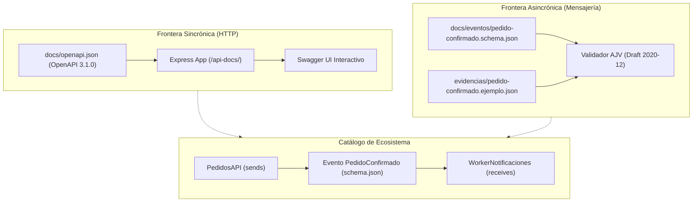

# Bitácora Clase 06: Documentación de Contratos y Eventos — OpenAPI 3.1, JSON Schema y EventCatalog
**Rama:** [[Hub_IAEW|IAEW]]  
**Tags:** #materia/iaew #openapi #swagger #jsonschema #eventcatalog #c4model #adr #microservicios #arquitectura #contratos  
**Fecha:** 2026-09-28  
**Estado:** Completado 100%  

---

## 🎯 1. Introducción y Fundamentos de la Clase

En sistemas distribuidos, microservicios e integraciones web, **el código funcionando no es suficiente**:
1. **Contratos HTTP Explícitos:** Un equipo consumidor no debe leer el código fuente de Express ni deducir middlewares para conocer endpoints, headers requeridos (`Idempotency-Key`), scopes de seguridad (`confirm:pedidos` con audience `https://iaew-pedidos-api`) ni códigos de error (200, 400, 401, 403, 404, 409, 503). Para esto estandarizamos con **OpenAPI 3.1.0** y lo exponemos visualmente con **Swagger UI** en `/api-docs/`.
2. **Contratos de Eventos Asíncronos Estrictos:** En RabbitMQ o Kafka, el routing key `pedido.confirmado` no especifica la estructura del payload. Sin un contrato formal, una modificación del emisor rompe silenciosamente a los workers consumidores. Para esto utilizamos **JSON Schema (Draft 2020-12)** con validación estricta (`additionalProperties: false`, formatos `uuid` y `date-time`) verificado mediante **AJV**.
3. **Visibilidad de Topología de Eventos:** Necesitamos conocer qué servicio produce el evento (`PedidosAPI` - `sends`), qué versión circula (`PedidoConfirmado 1.0.0`) y qué servicios dependen de él (`WorkerNotificaciones` - `receives`). Para esto implementamos **EventCatalog**.
4. **Fundamentación Arquitectónica:** Para el Trabajo Práctico Integrador (TPI) documentamos con el **C4 Model** (Context, Container, Component) y **ADRs** (*Architecture Decision Records*).

---

## 🗺️ 2. Arquitectura de Documentación y Flujo de Contratos

---

## 📋 3. Matriz de Componentes y Evidencias Requeridas

| Actividad | Componente / Archivo | Propósito | ¿Lleva Captura? / Salida Esperada |
| :--- | :--- | :--- | :--- |
| **A1: Base** | Pruebas unitarias/integración | Comprobar que la base de Clase 05 esté 100% en verde. | 📸 **SÍ (Evidencia 1):** Terminal con `npm test` y `npm run check` pasando en verde. |
| **A2: OpenAPI** | `docs/openapi.json` | Contrato OpenAPI 3.1.0 completo con 7 respuestas HTTP y seguridad OAuth 2.0. | 📸 **SÍ (Evidencia 2):** Navegador en `http://localhost:3000/api-docs/` con `POST /pedidos/{id}/confirmar` expandido. |
| **A3: Evento** | `docs/eventos/pedido-confirmado.schema.json` | JSON Schema estricto (Draft 2020-12) del evento `pedido.confirmado`. | 📸 **SÍ (Evidencia 3):** Terminal ejecutando `npx ajv validate` con resultado `valid`. |
| **A4: EventCatalog** | `eventcatalog-clase-06/` | Catálogo visual conectando Productor $\rightarrow$ Evento $\rightarrow$ Consumidor. | 📸 **SÍ (Evidencia 4):** Pantalla del navegador o terminal de `npm run build` en EventCatalog. |
| **A5: Cierre** | `evidencias/documentacion-clase-06.md` | Informe final de entrega y empaquetado ZIP sin dependencias pesadas. | 📦 **ZIP:** `iaew-2026-ecommerce-api-clase-06-entrega-final.zip` listo para entrega. |

---

## 🛠️ 4. Especificaciones Técnicas de los Contratos

### 🔹 4.1. Contrato OpenAPI 3.1.0 (`POST /pedidos/{id}/confirmar`)
* **Parámetros:**
  - `id` (path): ObjectId MongoDB (`^[a-fA-F0-9]{24}$`).
  - `Idempotency-Key` (header, required): String de 8 a 128 caracteres (`^[A-Za-z0-9._:-]+$`).
* **Seguridad:**
  - Esquema `oauth2` tipo `clientCredentials`, audience `https://iaew-pedidos-api` y scope `confirm:pedidos`.
* **Respuestas Documentadas (7 estados):**
  - `200 OK`: Pedido confirmado o replay idempotente (`Idempotency-Replayed: true/false`).
  - `400 Bad Request`: Payload o Idempotency-Key con formato inválido.
  - `401 Unauthorized`: Token ausente, firma inválida o expirado.
  - `403 Forbidden`: Token válido pero carece del scope `confirm:pedidos`.
  - `404 Not Found`: Pedido inexistente en base de datos.
  - `409 Conflict`: Estado del pedido incompatible, stock agotado o clave reutilizada con otro pedido.
  - `503 Service Unavailable`: Broker RabbitMQ inaccesible para publicar el evento.

### 🔹 4.2. JSON Schema Draft 2020-12 (`pedido.confirmado`)
* **Propiedades Raíz:**
  - `eventId`: Formato `uuid` obligatorio.
  - `type`: Constante `"pedido.confirmado"`.
  - `version`: Constante numérico `1`.
  - `occurredAt`: Formato `date-time` ISO 8601.
  - `data`: Objeto obligatorio que contiene `{ "pedidoId": "string" }`.
* **Restricción:** `additionalProperties: false` para evitar polución de esquema.

### 🔹 4.3. Topología en EventCatalog
* `services/PedidosAPI/index.mdx`: Declara `sends: [ { id: PedidoConfirmado, version: 1.0.0 } ]`.
* `events/PedidoConfirmado/index.mdx`: Declara `schemaPath: schema.json`.
* `services/WorkerNotificaciones/index.mdx`: Declara `receives: [ { id: PedidoConfirmado, version: 1.0.0 } ]`.

---

## 🏛️ 5. Recursos para el TPI: C4 Model y ADRs

1. **C4 Model (Context, Container, Component):**
   - **Nivel 1 (Contexto):** Muestra el sistema e-commerce interactuando con usuarios y sistemas externos (Pasarela de Pagos, Proveedor de Envíos, Identity Provider Auth0/Keycloak).
   - **Nivel 2 (Contenedores):** Muestra las aplicaciones ejecutables (Single Page Application, API Express Gateway, Workers Node.js, Base MongoDB, Broker RabbitMQ).
   - **Nivel 3 (Componentes):** Muestra la arquitectura interna de la API (Controllers, Middlewares de Seguridad/Idempotencia, Servicios de Negocio, Repositorios).
2. **ADR (Architecture Decision Records):**
   - Registro formal de decisiones técnicas (ej: Por qué usar *At-Least-Once con Deduplicación en Consumidor* en lugar de *Transacciones Distribuidas 2PC*).

---

*Conexiones conceptuales:*
- [[2026-09-17_actividad_clase_05_resiliencia_idempotencia_retry_dlq|Clase 05: Resiliencia de Integraciones, Idempotencia y DLQ]]
- [[2026-09-17_instructivo_clase_05_resiliencia_paso_a_paso|Instructivo Paso a Paso: Laboratorio Clase 05]]
- [[2026-08-31_seguridad_apis_middlewares_rbac_ia|Seguridad en APIs: Middlewares y RBAC]]
- [[2026-08-10_apis_y_servicios_web|APIs y Servicios Web]]
- [[2026-08-20_que_es_postman_y_colecciones_api|Postman y Colecciones de APIs]]
