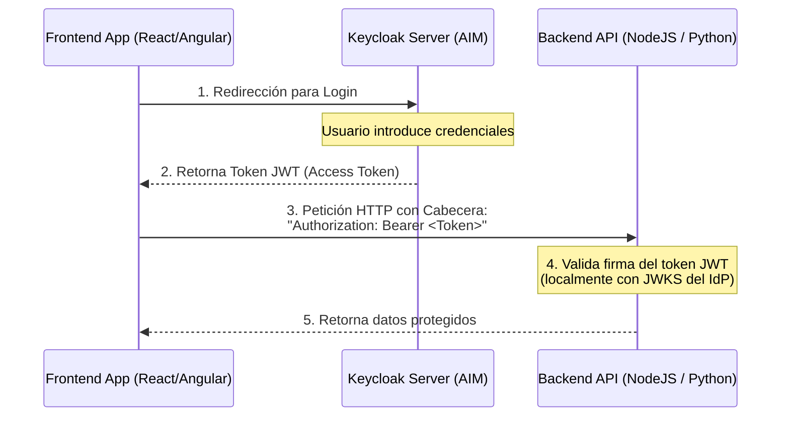

# Conceptos de Seguridad: ¿Qué es Keycloak (AIM)?

**Materia:** Diseño de Sistemas / Integración de Aplicaciones en Entorno Web (UTN FRC)  
**Fecha:** 2026-08-13  
**Categoría:** Seguridad y Autenticación Web  

---

**Keycloak** (llamado en el entorno de la UTN FRC como **AIM** - *Access and Identity Management*) es una herramienta open-source de **Gestión de Identidades y Accesos (IAM)**. 

Se utiliza para delegar y centralizar la seguridad de las aplicaciones web y APIs, de modo que los desarrolladores no tengan que programar formularios de login, almacenamiento de contraseñas cifradas ni gestión de sesiones desde cero.

---

## 🛠️ Funcionalidades Principales de Keycloak

1. **Single Sign-On (SSO) y Single Sign-Out:**
   * Permite que un usuario inicie sesión una sola vez y obtenga acceso a múltiples aplicaciones independientes (ej. el sistema de alumnos, el sistema de bedelía y la biblioteca) sin volver a ingresar sus credenciales.
2. **Proveedor de Identidad (Identity Provider - IdP):**
   * Implementa los protocolos estándar de seguridad de la industria: **OpenID Connect (OIDC)**, **OAuth 2.0** y **SAML 2.0**.
   * Es el encargado de emitir los **ID Tokens** y **Access Tokens (JWT)** firmados.
3. **Gestión Centralizada de Usuarios y Roles:**
   * Permite a los administradores crear usuarios, definir sus contraseñas, agruparlos y asignarles **Roles** (ej. `admin`, `alumno`, `docente`).
   * Estos roles luego se viajan en el JWT para que las APIs verifiquen los permisos (RBAC - *Role-Based Access Control*).
4. **Registro de Clientes (Applications / Clients):**
   * En Keycloak, cada aplicación frontend (React, Angular) o backend (NodeJS, Java Spring) que quiera usar la seguridad debe registrarse como un **Client**.
   * Aquí se configuran los flujos de OAuth 2.0 (ej. *Authorization Code Flow with PKCE*) y las URLs de redirección permitidas.
5. **Mappers de Claims:**
   * Permite mapear atributos del perfil del usuario (como legajo, carrera o email) directamente dentro de los campos (*claims*) del token JWT.

---

## ⚙️ ¿Cómo se usa en DDS / IAEW?

En tus materias de la facultad, Keycloak se utiliza como el servidor central de autenticación para tus proyectos. El flujo típico es:

---
*Nota registrada automáticamente en el Baúl de Obsidian UTN.*
