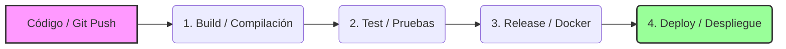

# Conceptos Fundamentales: ¿Qué es una Pipeline?

**Materia:** Integración de Aplicaciones en Entorno Web (UTN FRC)  
**Fecha:** 2026-08-13  
**Categoría:** DevOps y Despliegue Web  

---

En ingeniería de software y desarrollo web, una **pipeline** (o canalización) es una secuencia de **pasos automatizados encadenados** donde la salida (*output*) de una etapa sirve directamente como la entrada (*input*) de la siguiente. 

La analogía más simple es una **línea de ensamblaje industrial**: el producto entra como materia prima (código fuente) y pasa por diferentes estaciones de trabajo automatizadas (compilación, pruebas, empaquetado) hasta salir terminado y listo para el cliente (despliegue en producción).

---

## 🚀 1. Pipelines de CI/CD (Integración y Despliegue Continuo)

En el ámbito de la materia **IAEW**, las pipelines más relevantes son las de **CI/CD**. Estas automatizan el ciclo de vida del software desde que el desarrollador hace `git push` hasta que el código está corriendo en la nube.

### Fases Típicas de una Pipeline CI/CD:

1. **Build (Construcción/Compilación):**
   * El código se descarga en un entorno limpio.
   * Se instalan las dependencias (ej. `npm install`, `pip install`).
   * Se compila el proyecto (ej. transformar TypeScript a JavaScript, o generar binarios).
2. **Test (Pruebas Automatizadas):**
   * Se ejecutan pruebas unitarias, de integración y análisis de código estático (linters).
   * Si alguna prueba falla, la pipeline se detiene inmediatamente y notifica al equipo (evitando que código roto llegue a producción).
3. **Release (Empaquetado):**
   * Se empaqueta la aplicación, frecuentemente construyendo una **imagen de Docker** y subiéndola a un registro (ej. Docker Hub, AWS ECR).
4. **Deploy (Despliegue):**
   * La aplicación compilada y testeada se envía al servidor o plataforma de hosting (ej. AWS, Vercel, Render, Kubernetes).

---

## 📊 2. Pipelines de Datos (Data Pipelines)

Otro tipo común son las de procesamiento de información, que mueven datos desde un origen hacia un destino, transformándolos en el camino.

* **Flujo ETL (Extract, Transform, Load):**
  1. **Extraer:** Obtener datos de bases de datos, APIs externas o logs.
  2. **Transformar:** Limpiar, filtrar, estructurar o agregar datos.
  3. **Cargar:** Guardar el resultado en un almacén centralizado (Data Warehouse) para análisis.

---

## 🎯 Beneficios de usar Pipelines en Entornos Web

* **Automatización:** Elimina tareas manuales repetitivas y reduce el error humano.
* **Consistencia:** El proceso de compilación, testeo y despliegue es idéntico cada vez.
* **Feedback Rápido:** Los desarrolladores saben en minutos si su código rompió alguna funcionalidad.
* **Despliegues Frecuentes y Seguros:** Permite entregar valor a producción de manera constante y con un riesgo muy bajo.

---
*Nota registrada automáticamente en el Baúl de Obsidian UTN.*
