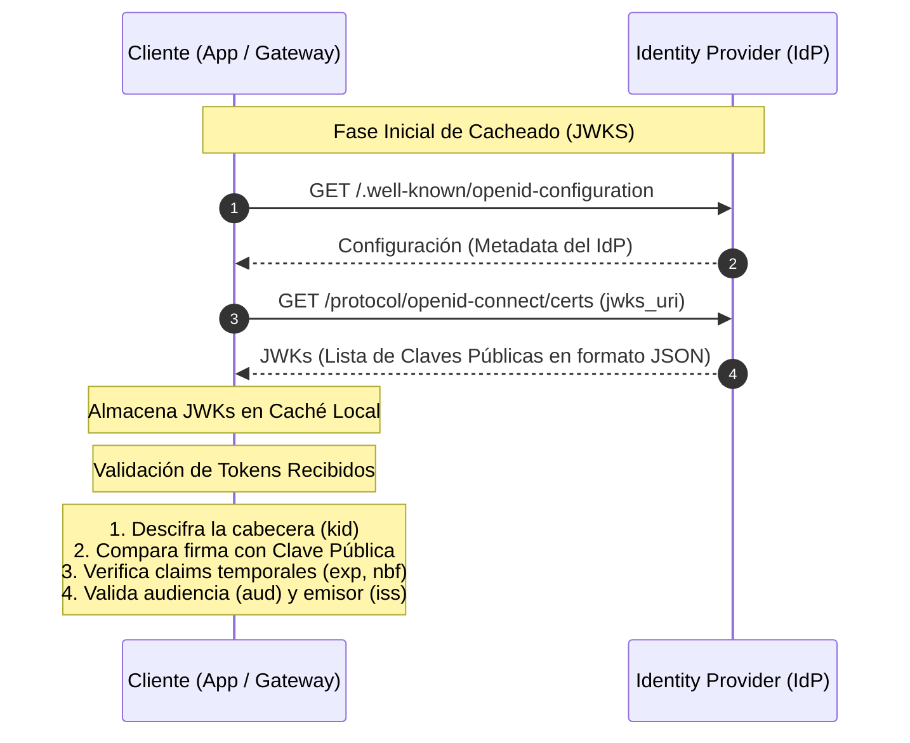
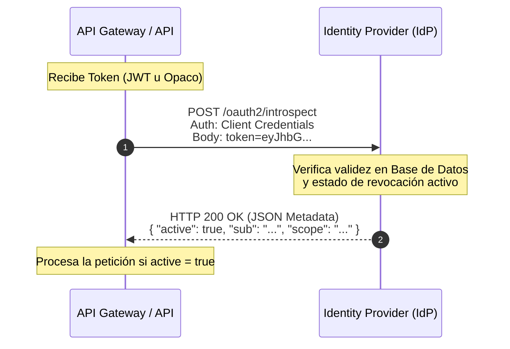

# Conceptos de Seguridad: Validación en OIDC y OAuth 2.0

**Materia:** Integración de Aplicaciones en Entorno Web (UTN FRC)  
**Fecha:** 2026-08-13  
**Categoría:** Seguridad y Autenticación Web  

---

Esta nota describe el funcionamiento de los mecanismos de seguridad de **OpenID Connect (OIDC)** y **OAuth 2.0**, enfocándose en los claims de los tokens y los dos métodos principales de validación (local vs. remota).

---

## 🔐 1. Claims más significativos en un token JWT

Un **JSON Web Token (JWT)** firmado (como un *ID Token* o un *Access Token*) contiene claims (atributos) que proporcionan metadatos del usuario, el emisor y el estado de validez del token.

### 🧩 Claims Estándar y su Propósito

| Claim | Nombre | Descripción | Ejemplo de Valor |
| :--- | :--- | :--- | :--- |
| **`iss`** | *Issuer* | Identifica a la entidad/servidor que emitió el token. | `"https://keycloak.example.com/realms/myrealm"` |
| **`sub`** | *Subject* | Identificador único y permanente del usuario (sujeto) en el emisor. | `"8c7a9b32-42f9-41cd-97fa-9b90c1f6d338"` |
| **`aud`** | *Audience* | Destinatario del token. Indica qué API o Cliente tiene permitido usarlo. | `"my-api"` |
| **`exp`** | *Expiration Time* | Marca temporal (Epoch Unix) que indica cuándo expira el token. | `1739703200` |
| **`iat`** | *Issued At* | Marca temporal (Epoch Unix) de cuándo fue emitido el token. | `1739700000` |
| **`nbf`** | *Not Before* | Marca temporal antes de la cual el token no debe ser aceptado. | `1739699900` |
| **`auth_time`** | *Authentication Time*| Momento en que ocurrió la autenticación inicial del usuario. | `1739699000` |
| **`azp`** | *Authorized Party* | El ID del cliente de OAuth 2.0 autorizado para presentar este token. | `"my-client-id"` |
| **`scope`** | *Scopes* | Lista separada por espacios de los ámbitos/permisos autorizados. | `"openid profile email"` |
| **Perfil** | *User info* | Campos específicos del perfil del usuario (estándar en OIDC). | `email: "juan@example.com"`, `name: "Juan Pérez"` |

> [!TIP]
> **Diferencia clave entre Tokens:**
> * **ID Tokens (OIDC):** Están orientados a la **identidad** del usuario (contienen nombres, emails, etc.) y son leídos por la aplicación cliente.
> * **Access Tokens (OAuth 2.0):** Están orientados a la **autorización** (scopes y audiencias) y son consumidos y validados por las APIs (Resource Servers).

---

## ⚙️ 2. Flujos de Validación de Token: Local vs. Remoto (/introspect)

### A. Validación Local (Criptográfica en Código)

La aplicación o API Gateway valida la autenticidad del JWT de manera autónoma utilizando la clave pública criptográfica del Servidor de Identidad (IdP).

> [!NOTE]
> **Ventajas:**
> * **Latencia mínima:** No realiza llamadas de red para validar cada solicitud.
> * **Alta Escalabilidad:** No satura el Servidor de Identidad.
>
> **Desventajas:**
> * **Revocación tardía:** Si un token es revocado antes de su `exp` en el IdP, el API Gateway local no lo sabrá hasta que expire.

---

### B. Validación Remota (Mediante Endpoint `/introspect`)

El API Gateway o Servidor de Recursos envía el token al endpoint de introspección del IdP en cada petición para comprobar su estado de validez y revocación.

> [!NOTE]
> **Ventajas:**
> * **Estado en tiempo real:** Soporta revocación instantánea (útil para logout global o desactivación de cuentas).
> * **Soporte de Tokens Opacos:** Permite usar strings aleatorios que no revelan datos del usuario en tránsito.
>
> **Desventajas:**
> * **Impacto de Red:** Agrega latencia en cada endpoint protegido.
> * **Punto único de fallo:** Si el IdP se cae, toda la validación de peticiones falla.

---

## 🧠 Resumen Comparativo

| Característica | Validación Local (Código) | Validación Remota (Endpoint `/introspect`) |
| :--- | :--- | :--- |
| **Tipo de Token compatible** | JWT Firmado (Autocontenido) | Tokens Opacos y JWT |
| **Verificación de Firma** | Realizada localmente con JWKS cached | Realizada por el IdP internamente |
| **Detección de Revocación** | ❌ No (hasta que el token expira por tiempo) | ✅ Sí (consulta en tiempo real al IdP) |
| **Latencia adicional** | ⚡ Ultra baja (<1ms) | 🌐 Media-Alta (depende del viaje de red al IdP) |
| **Dependencia de Red activa**| No | Sí (por cada petición) |
| **Escalabilidad** | Alta (Escala horizontalmente sin límites) | Limitada por la capacidad de carga del IdP |
| **Caso de uso recomendado** | Microservicios internos, APIs de alto tráfico | Gateways principales, tokens de sesión revocables, tokens opacos |

---

## 🏷️ 3. Nombres Técnicos Oficiales en la Industria

* **Validación Local:**
  * **Nombre oficial/estándar:** **Validación Local de JWT** (*Local JWT Validation*) o **Validación de Token Autocontenido** (*Self-contained Token Validation*).
  * **Otros términos comunes:** Validación *Offline* o Validación *In-Process*.
  * **Elemento clave:** Requiere del estándar **JWKS (JSON Web Key Sets)** para obtener las claves públicas criptográficas.

* **Validación Remota:**
  * **Nombre oficial/estándar:** **Introspección de Tokens OAuth 2.0** (*OAuth 2.0 Token Introspection*), formalizado bajo el estándar de la IETF en la especificación **RFC 7662**.
  * **Otros términos comunes:** Validación *Online* o Introspección Activa.
  * **Elemento clave:** Se comunica directamente con el endpoint `/introspect` (o similar) expuesto por el Identity Provider (IdP).

---

## 🔑 4. La Diferencia Clave (En una frase)

La diferencia fundamental reside en **dónde se verifica el estado de revocación del token**:
* La **Validación Local** asume que el token es válido si su firma criptográfica es correcta y no ha expirado por tiempo (rápido, pero ciego a la revocación).
* La **Validación Remota (/introspect)** le pregunta activamente al servidor de identidad (IdP) si el token sigue activo en ese preciso instante (lento por la red, pero con revocación en tiempo real).

---
*Nota registrada automáticamente en el Baúl de Obsidian UTN.*
