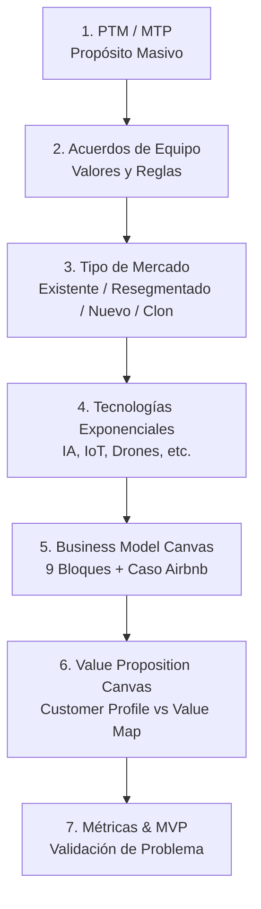

# Metodología y Actividades: Sprint 1 (ExO Launchpad / Emprendimientos Tecnológicos)

**Materia Hub:** [[2026-08-14_emprendimientos_tecnologicos_utn_frc|Emprendimientos Tecnológicos]]  
**Tags:** #materia/emprendimientos-tecnologicos #sprint1 #ptm #canvas #lean-startup #exo #agtech  
**Fecha:** 2026-08-28  
**Fuente:** Clase grabada `Sprint 1.mp4` (~55 min)  

---

## 🧭 Flujo de Actividades del Sprint 1

---

## 📌 1. Actividad 1: Definición del PTM (Propósito de Transformación Masiva)
* **Concepto:** Declaración aspiracional y audaz que responde al *por qué* existe el emprendimiento. 
* **Regla clave:** Enfoque hacia afuera (impacto en la comunidad/mundo), nunca hacia adentro ni con metas corporativas egoístas (evitar: *"ser la empresa más grande"*).
* **Ejemplos:** Google (*Organizar la información del mundo*), TED (*Ideas worth spreading*), Nike (*Llevar inspiración e innovación a cada atleta del mundo*).
* **Dinámica en Mural:** Post-its individuales ➔ Puesta en común ➔ Síntesis consensuada.

---

## 🤝 2. Actividad 2: Acuerdos de Equipo (*Team Agreements*)
* **Valores:** Confianza, respeto, transparencia, compromiso.
* **Reglas operativas:**
  * Horarios y frecuencia de reuniones (stand-ups de 15 min, semanales de 1h).
  * Canales de comunicación oficiales (Slack, WhatsApp, Discord, Notion).
  * Toma de decisiones (por consenso o votación).
  * Manejo de bloqueos y puntualidad.

---

## 🎯 3. Actividad 3: Tipos de Mercado (Steve Blank)
* **Mercado Existente:** Clientes y competidores consolidados. Estrategia: producto superior/rendimiento.
* **Mercado Resegmentado (Nicho):** Foco exclusivo en un subsegmento desatendido.
* **Mercado Resegmentado (Bajo Costo):** Entrada con precios/costos drásticamente menores.
* **Mercado Nuevo:** Sin competidores previos; requiere evangelizar y educar al cliente.
* **Mercado Clon:** Adaptar a nivel local/regional un modelo exitoso probado en el exterior (ej. Mercado Libre).

---

## 📊 4. Actividad 5: Business Model Canvas (BMC)
* **Regla de colores:** Si existen múltiples segmentos (ej. Airbnb: Huéspedes y Anfitriones), usar códigos de color distintos en todo el lienzo para relacionar propuesta, segmento, canal y flujo de ingresos.
* **9 Bloques:** Propuesta de Valor, Segmentos de Clientes, Canales (comunicación, evaluación, compra, entrega, post-venta), Relaciones con Clientes, Fuentes de Ingresos, Recursos Clave, Actividades Clave, Socios Clave y Estructura de Costos.

---

## 🔍 5. Actividad 6: Lienzo de Propuesta de Valor (*Value Proposition Canvas*)
* **Perfil del Cliente (Círculo):** Customer Jobs (tareas a resolver), Pains (dolores, frustraciones, costos, riesgos) y Gains (alegrías y expectativas superadas).
* **Mapa de Valor (Cuadrado):** Productos/Servicios, Pain Relievers (aliviadores específicos de dolores) y Gain Creators (generadores de alegrías).

---

## 📈 6. Actividades 7 y 8: Cronograma, Métricas del Problema y MVP
* **Cronograma:** Seguimiento en Trello.
* **Métricas del Problema:** Indicadores objetivos para validar si el problema duele lo suficiente.
* **MVP:** Prototipo simple para validar hipótesis rápido (*Lean Startup*).
