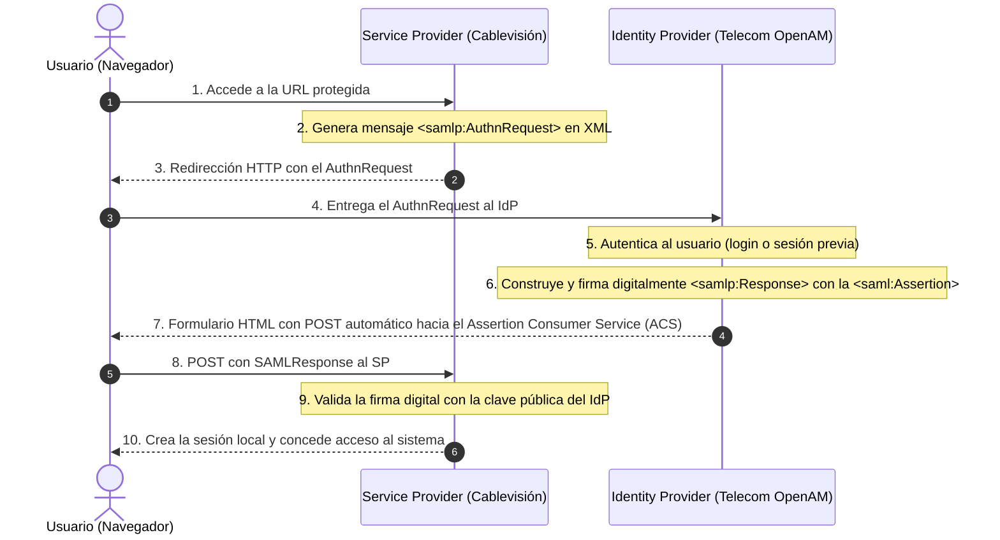

# Protocolo SAML 2.0: Autenticación Federada y Single Sign-On (SSO)

**Materia Hub:** [[2026-08-10_integracion_aplicaciones_web_utn_frc|IAEW]]  
**Tags:** #materia/iaew #seguridad #saml #sso #federacion #xml #utn  
**Fecha:** 2026-08-27  
**Categoría:** Seguridad e Identidad Digital  

---

## 📌 1. ¿Qué es SAML (Security Assertion Markup Language)?

**SAML** es un estándar abierto basado en **XML** diseñado para la **autenticación federada y el Single Sign-On (SSO)** en entornos corporativos y B2B.

Permite que un usuario inicie sesión una sola vez en un sistema central y acceda a múltiples aplicaciones independientes sin tener que reingresar sus credenciales.

---

## 👥 2. Actores Principales en SAML

1. **Identity Provider (IdP):**  
   El sistema emisor que autentica al usuario (ej: *OpenAM, Telecom IdP, Okta, Microsoft ADFS*).
2. **Service Provider (SP):**  
   La aplicación o portal de destino que el usuario desea utilizar (ej: *Cablevisión Fibertel, Salesforce, Portal del Empleado*).
3. **Principal (Usuario / Navegador):**  
   El agente que navega entre el SP y el IdP.

---

## 🔄 3. Flujo de Autenticación SAML (SP-Initiated SSO)



---

## 📄 4. Estructura de Mensajes XML en SAML

### A. Solicitud de Autenticación (`<AuthnRequest>`):
```xml
<samlp:AuthnRequest
    xmlns:samlp="urn:oasis:names:tc:SAML:2.0:protocol"
    xmlns:saml="urn:oasis:names:tc:SAML:2.0:assertion"
    ID="ONELOGIN_123456"
    Version="2.0"
    IssueInstant="2026-08-27T12:00:00Z"
    Destination="https://saml.telecom.com.ar/openam/SSOPOST"
    AssertionConsumerServiceURL="https://www.cablevisionfibertel.com.ar/saml/acs">
    <saml:Issuer>CablevisionDigitalSaml</saml:Issuer>
</samlp:AuthnRequest>
```

### B. Respuesta con Aserción de Identidad (`<samlp:Response>`):
```xml
<samlp:Response
    xmlns:samlp="urn:oasis:names:tc:SAML:2.0:protocol"
    xmlns:saml="urn:oasis:names:tc:SAML:2.0:assertion"
    Destination="https://www.cablevisionfibertel.com.ar/saml/acs">
    <saml:Issuer>https://saml.telecom.com.ar/openam</saml:Issuer>
    <saml:Assertion ID="_assertion_789" Version="2.0">
        <saml:Subject>
            <saml:NameID>usuario@example.com</saml:NameID>
        </saml:Subject>
        <saml:AttributeStatement>
            <saml:Attribute Name="name">Juan Pérez</saml:Attribute>
            <saml:Attribute Name="id">12345</saml:Attribute>
        </saml:AttributeStatement>
    </saml:Assertion>
</samlp:Response>
```

---

## 🛠️ 5. Herramienta de Diagnóstico: SAML-Tracer

Para depurar y auditar flujos SAML en navegadores web (Chrome / Firefox), se utiliza la extensión **SAML-Tracer**, la cual intercepta y formatea los mensajes XML intercambiados entre el IdP y el SP.

---

## ⚖️ 6. ¿Se puede cumplir el objetivo de SAML con OIDC? (Equivalencias Directas)

**Sí, absolutamente al 100%.** De hecho, OIDC fue diseñado por la OpenID Foundation para **suceder y modernizar a SAML**.

### Mapeo de Conceptos (SAML ➔ OIDC):
| Concepto SAML (XML Antiguo) | Concepto OIDC (JSON / REST Moderno) | Función que cumplen |
| :--- | :--- | :--- |
| **Identity Provider (IdP)** | **OpenID Provider (OP / IdP)** | Emite la identidad (Keycloak, Google, Auth0). |
| **Service Provider (SP)** | **Relying Party (RP / Client)** | Aplicación web consumidora. |
| **Aserción SAML (`<Assertion>`)** | **ID Token (JWT)** | Documento firmado con los datos del usuario. |
| **Certificados X.509** | **Claves Públicas JWKS (`/certs`)** | Validan la firma digital del token. |
| **`AuthnRequest`** | Petición `GET /auth` | Redirección de login con `response_type=code`. |

### ¿Por qué OIDC superó a SAML en el desarrollo moderno?
1. **Soporte Nativo para Móviles y SPAs:** Mediante el flujo **PKCE**, OIDC elimina la necesidad de secretos en el cliente. SAML era casi inviable en celulares.
2. **Autorización de APIs REST:** OIDC (construido sobre OAuth 2.0) entrega un `access_token` para invocar microservicios protegidos. SAML solo servía para sesiones de navegador.
3. **Eficiencia y Peso:** Un JWT pesa una fracción en bytes comparado con las voluminosas respuestas XML de SAML.

---
*Conexiones conceptuales:*
- [[2026-08-27_oidc_flujo_pkce_authorization_code|OpenID Connect y Flujo PKCE]]
- [[2026-08-27_ldap_protocolo_directorio_e_integracion_oidc|Protocolo LDAP y Directorios Corporativos]]
- [[2026-08-13_analogia_oidc_oauth2|Analogía OIDC y OAuth2]]

