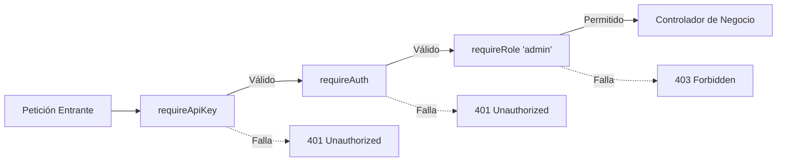

# Seguridad en APIs REST: Middlewares, Control de Acceso por Roles (RBAC) y Gobierno de IA

**Materia Hub:** [[2026-08-10_integracion_aplicaciones_web_utn_frc|IAEW]]  
**Tags:** #materia/iaew #seguridad #express #nodejs #middlewares #rbac #api-key #ia #mcp #utn  
**Fecha:** 2026-08-31  
**Categoría:** Seguridad y Arquitectura de Software  

---

## 🎯 1. Principio Fundamental: Autenticación vs. Autorización

En el diseño de APIs empresariales, la seguridad se estructura en dos capas complementarias:

1. **Autenticación (¿Quién sos?):**  
   Verificación de la identidad del llamador mediante credenciales (API Keys, Bearer Tokens, JWT o firmas digitales).
2. **Autorización (¿Qué tenés permitido hacer?):**  
   Evaluación de los permisos o roles asignados al usuario autenticado frente a la acción solicitada (**RBAC - Role-Based Access Control**).

> [!IMPORTANT]
> **Regla de la Cátedra:**  
> *"Una API segura no solo pregunta quién sos. También pregunta qué podés hacer."*

---

## ⚙️ 2. Patrón de Middlewares en Express (Chain of Responsibility)

Un **Middleware** es una función intermediaria que intercepta la petición HTTP antes de que alcance el controlador final. Permite desacoplar las reglas de seguridad de la lógica de negocio.



### Anatomía y Funcionamiento Línea por Línea:

#### A. `requireApiKey` (Validación de Integración Interna)
Verifica que el servicio llamador conozca la clave secreta compartida en las variables de entorno (`INTERNAL_API_KEY`):
```javascript
function requireApiKey(req, res, next) {
  const apiKey = req.header('x-api-key');
  const expectedApiKey = process.env.INTERNAL_API_KEY;

  if (!expectedApiKey) {
    return res.status(500).json({ error: 'API key interna no configurada' });
  }
  if (!apiKey || apiKey !== expectedApiKey) {
    return res.status(401).json({ error: 'API key inválida o ausente' });
  }

  next(); // Da paso al siguiente middleware
}
```

#### B. `requireAuth` (Identificación e Inyección de `req.user`)
Valida el token Bearer y enriquece el objeto de la petición con la identidad del usuario para el resto de la tubería:
```javascript
function requireAuth(req, res, next) {
  const authorization = req.header('authorization');
  if (!authorization || !authorization.startsWith('Bearer ')) {
    return res.status(401).json({ error: 'Token ausente' });
  }

  const token = authorization.replace('Bearer ', '').trim();
  const usuario = usuariosDemo[token];
  if (!usuario) {
    return res.status(401).json({ error: 'Token inválido' });
  }

  // 🌟 Inyección de Contexto: Permite que los middlewares posteriores conozcan al usuario
  req.user = usuario;
  next();
}
```

#### C. `requireRole(rolPermitido)` (Función de Orden Superior para RBAC)
Devuelve una función middleware parametrizada con el rol exigido en cada endpoint:
```javascript
function requireRole(rolPermitido) {
  return (req, res, next) => {
    if (!req.user) {
      return res.status(401).json({ error: 'Usuario no autenticado' });
    }
    if (req.user.rol !== rolPermitido) {
      // 403 Forbidden: Autenticado pero sin privilegios suficientes
      return res.status(403).json({ error: 'Permisos insuficientes' });
    }

    next();
  };
}
```

---


## 🚦 3. Matriz de Códigos de Estado HTTP en Seguridad

| Código HTTP | Significado Semántico | Criterio de Uso |
| :---: | :--- | :--- |
| **`401 Unauthorized`** | *Falta de Autenticación* | El cliente no presentó credenciales, el token expiró o la API Key es errónea. **"No sé quién sos"**. |
| **`403 Forbidden`** | *Falta de Autorización* | El cliente está autenticado, pero carece de permisos suficientes para la acción. **"Sé quién sos, pero no tenés permiso"**. |
| **`409 Conflict`** | *Conflicto de Estado* | La petición es válida, pero choca contra una regla de negocio del recurso (ej: doble confirmación de pedido o falta de stock). |
| **`500 Internal Server Error`** | *Falla del Servidor* | Error inesperado en el servidor o variable de entorno de seguridad no configurada (`INTERNAL_API_KEY`). |

---

## 🤖 4. Seguridad de APIs y Gobernanza frente a Agentes de IA (MCP)

Cuando se exponen herramientas de una API a **Modelos de Lenguaje (LLMs)** y **Agentes Autónomos** mediante protocolos como **MCP (Model Context Protocol)**, los riesgos de ejecución se multiplican:

### Riesgos Principales:
1. **Fuga de Información en Lecturas Sensibles:**  
   Si un agente tiene acceso irrestricto a `GET /pedidos`, podría indexar y filtrar información confidencial o datos personales protegidos (PII).
2. **Impacto en Escrituras Críticas y Transaccionales:**  
   Endpoints como `POST /productos` (modificación del catálogo) o `POST /pedidos/:id/confirmar` (compromiso financiero y descuento de stock físico) no deben ejecutarse automáticamente sin supervisión humana o roles estrictos (`admin` / `cliente`).

### Medidas de Mitigación:
* **Principio de Menor Privilegio (*Least Privilege*):** Asignar tokens específicos para cada agente con scopes acotados.
* **Registro de Auditoría Inmutable (*Audit Trail*):** Registrar para cada invocación del agente:
  * Fecha y hora exacta (`timestamp`).
  * Identificador del usuario y del agente (`userId`, `agentTool`).
  * Dirección IP de origen.
  * Endpoint, método HTTP y payload enviado.
  * Código de estado HTTP resultante.

---
*Conexiones temáticas:*
- [[2026-08-31_actividad_clase_03_seguridad_api_middlewares_roles|Actividad Práctica Clase 03]]
- [[2026-08-10_apis_y_servicios_web|APIs y Servicios Web]]
- [[2026-08-13_seguridad_y_validacion_oidc_oauth2|Seguridad y Validación OIDC / OAuth2]]
