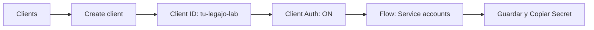

# Instructivo Completo: Laboratorio de JWT, Keycloak y Validación Local de Firmas

**Materia Hub:** [[2026-08-10_integracion_aplicaciones_web_utn_frc|Integración de Aplicaciones Web (IAEW)]]  
**Universidad:** UTN FRC (Facultad Regional Córdoba)  
**Tags:** #materia/iaew #seguridad #jwt #keycloak #postman #nodejs #instructivo #guia  
**Fecha:** 2026-08-20  

---

## 🎯 1. Objetivos del Laboratorio
1. Comprender el mecanismo de **Descubrimiento OIDC** (*OpenID Connect Discovery*) y el rol de cada endpoint.
2. Crear y configurar un cliente confidencial en **Keycloak (AIM)** para comunicación Máquina a Máquina (*Machine-to-Machine*) con el flujo `client_credentials`.
3. Probar la obtención de tokens y la introspección remota en **Postman**.
4. Ejecutar y entender la **validación local de firmas JWT** en una aplicación **Node.js** utilizando el conjunto de claves públicas **JWKS** (`/certs`) sin sobrecargar el servidor de identidad.

---

## 📋 2. Requisitos y Datos del Entorno
* **Consola de Keycloak (AIM):** [https://labsys.frc.utn.edu.ar/aim/admin/dds-materia/console/#/](https://labsys.frc.utn.edu.ar/aim/admin/dds-materia/console/#/)
* **Realm:** `dds-materia`
* **Credenciales de Administración del Realm:**
  * Usuario: `Dds-admin`
  * Contraseña: `dds12345`
* **Discovery Endpoint:** `https://labsys.frc.utn.edu.ar/aim/realms/dds-materia/.well-known/openid-configuration`
* **Herramientas:** Navegador Web, Postman, Node.js (v18+ o v20+).

---

## 🌐 3. Endpoints Clave del Discovery JSON

Al acceder al endpoint de descubrimiento, se obtienen las siguientes URLs estándar:

| Propiedad | Endpoint en el Servidor | Propósito |
| :--- | :--- | :--- |
| **`issuer`** | `.../aim/realms/dds-materia` | Identificador único del emisor. Coincide con el claim `iss` del JWT. |
| **`authorization_endpoint`** | `.../protocol/openid-connect/auth` | Pantalla de login para usuarios finales en aplicaciones Frontend. |
| **`token_endpoint`** | `.../protocol/openid-connect/token` | Recibe credenciales y devuelve el Access Token (JWT). |
| **`jwks_uri`** | `.../protocol/openid-connect/certs` | Publica las **claves públicas (JWKS)** para validar firmas localmente. |
| **`introspection_endpoint`** | `.../protocol/openid-connect/token/introspect` | Permite consultar en tiempo real al IdP si un token sigue activo (*RFC 7662*). |

---

## 🔑 4. Paso a Paso: Configuración del Cliente en Keycloak



1. Iniciar sesión en la consola de administración en el realm `dds-materia`.
2. En el menú lateral izquierdo, hacer clic en **Clients** ➔ Botón azul **Create client**.
3. **General Settings:**
   * *Client type:* `OpenID Connect`
   * *Client ID:* Escribir un nombre identificatorio (ej. `69650-martinsciarra-lab`).
   * Clic en **Next**.
4. **Capability config (Configuración de Capacidades):**
   * *Client Authentication:* Activar en **ON** *(genera el `client_secret`)*.
   * *Authentication flow:* Marcar la casilla **Service accounts roles** *(habilita el flujo `client_credentials`)*.
   * Clic en **Save**.
5. **Obtener el Secret:**
   * Entrar a la pestaña **Credentials** del cliente creado.
   * Copiar el valor del campo **Client Secret**.

---

## 📮 5. Paso a Paso: Pruebas en Postman

1. **Importar Archivos:**
   * Abrir Postman y hacer clic en **Import** (o presionar `Ctrl + O`).
   * Arrastrar o seleccionar la colección (`Keycloak-JWT-Lab.postman_collection.json`) y el entorno (`Keycloak-JWT-Lab.postman_environment.json`).
2. **Seleccionar y Configurar Entorno:**
   * En el selector de entornos (arriba a la derecha), elegir **`Keycloak JWT Lab - DDS`**.
   * Abrir el icono del ojo 👁️ y completar:
     * `ccClientId`: Tu Client ID (ej: `69650-martinsciarra-lab`).
     * `ccClientSecret`: Tu Client Secret copiado en Keycloak.
3. **Ejecutar Peticiones:**
   * **`01 - Discovery well-known` (GET):** Ejecutar `Send`. Carga automáticamente los endpoints en las variables del entorno. Status: `200 OK`.
   * **`02 - Token - Client Credentials` (POST):** Ejecutar `Send`. Envía credenciales Basic Auth y recibe el JWT en `access_token`. Status: `200 OK`. *(Evidencia 1)*.
   * **`03 - Introspect - Client Credentials` (POST):** Ejecutar `Send`. Envía el token a Keycloak y valida que devuelva `{"active": true}`. Status: `200 OK`. *(Evidencia 2)*.

---

## 💻 6. Paso a Paso: Validación Local en Node.js (`node-app-jwt`)

### 1. Configurar el Archivo `.env`
En la raíz del proyecto `node-app-jwt/`, configurar el archivo `.env`:
```env
KEYCLOAK_BASE_URL=https://labsys.frc.utn.edu.ar/aim
KEYCLOAK_REALM=dds-materia
CLIENT_ID=69650-martinsciarra-lab
CLIENT_SECRET=WtWoiQvYGtoikvrnuaLajyn6VU9s9wgN
EXPECTED_AUDIENCE=
PORT=3001
```

### 2. Iniciar el Servidor
```bash
npm install
npm start
```

### 3. Probar en el Navegador Web
1. Abrir `http://localhost:3001` en el navegador.
2. Hacer clic en **"Obtener un token"** ➔ La app consulta `/api/token` y muestra el JWT en pantalla.
3. Hacer clic en **"Validar firma localmente"** ➔ La app descarga las claves públicas de `jwks_uri`, valida la firma matemática con `jose` y comprueba expiración y emisor.
4. **Resultado:** Muestra `valid: true` con todos los checks en `OK`. *(Evidencia 3)*.

---

## 🧠 7. Fundamentos Teóricos de Validación: Local vs. Introspección

| Aspecto | Validación Local (Recomendada para APIs) | Introspección Remota (RFC 7662) |
| :--- | :--- | :--- |
| **Endpoint Utilizado** | **`jwks_uri`** (`/protocol/openid-connect/certs`) | **`introspection_endpoint`** (`/protocol/openid-connect/token/introspect`) |
| **¿Cómo opera?** | Descarga las claves públicas una vez (en caché) y valida la firma matemática en memoria. | Hace una llamada HTTP POST al IdP por cada request que llega a la API. |
| **Latencia de Red** | **0 ms** (validación instantánea en microsegundos). | Alta (decenas o cientos de ms por petición). |
| **Carga en el IdP** | Mínima (el IdP solo emite tokens y expone certs). | Máxima (el IdP se vuelve cuello de botella y punto único de fallo). |
| **Revocación** | Tolerancia pasiva mediante **Tokens de Vida Corta** (5-15 min). | Revocación inmediata en tiempo real. |
| **¿Cuándo usar?** | En arquitecturas de microservicios y APIs de alto rendimiento. | Con tokens opacos (no JWT) o en transacciones bancarias críticas. |

---

## 📸 8. Checklist de Evidencias a Entregar

- [x] **Captura 1:** Respuesta exitosa con `access_token` en Postman (`02 - Token`).
- [x] **Captura 2:** Respuesta con `"active": true` en Postman (`03 - Introspect`).
- [x] **Captura 3:** Pantalla web de la aplicación Node.js en `http://localhost:3001` con el resultado de **"Firma válida" / Checks: OK**.
