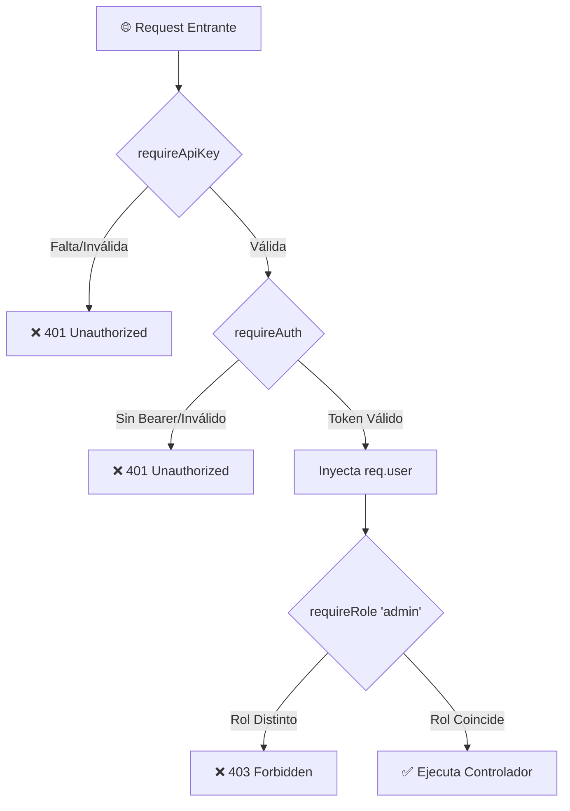

# Actividad Práctica Clase 03: Seguridad en API REST con Middlewares, Roles y API Keys

**Materia Hub:** [[2026-08-10_integracion_aplicaciones_web_utn_frc|IAEW]]  
**Universidad:** UTN FRC (Facultad Regional Córdoba)  
**Tags:** #materia/iaew #seguridad #express #nodejs #middlewares #api-key #roles #utn  
**Fecha:** 2026-08-31  

---

## 🎯 1. Objetivo de la Clase
Implementar una capa de seguridad básica y desacoplada en la API REST de e-commerce mediante **Middlewares en Express**, comprendiendo la diferencia entre:
1. **Autenticación:** ¿Quién sos? (Validación de API Key y Bearer Tokens).
2. **Autorización:** ¿Qué podés hacer? (Control de Acceso Basado en Roles - RBAC: `cliente` vs. `admin`).
3. **Códigos de Estado HTTP Semánticos:** `401 Unauthorized` vs. `403 Forbidden` vs. `409 Conflict`.

> [!IMPORTANT]
> **Regla de Oro de la Seguridad en APIs:**  
> *"Una API segura no solo pregunta quién sos. También pregunta qué podés hacer."*

---

## 🧩 2. Arquitectura de Middlewares Implementada

### Detalle de los 3 Middlewares ([`middleware/auth.js`](file:///C:/Users/arrai/OneDrive/Documentos/obsidian-utn/iaew-2026-ecommerce-api/middleware/auth.js)):
* **`requireApiKey`:** Valida que el header `x-api-key` coincida con la variable de entorno `process.env.INTERNAL_API_KEY`.
* **`requireAuth`:** Valida el header `authorization: Bearer <token>`, busca al usuario en el catálogo simulado e inyecta `req.user`.
* **`requireRole(rolPermitido)`:** Función de orden superior que comprueba si `req.user.rol === rolPermitido`.

---

## 🛡️ 3. Matriz de Protección de Endpoints

| Endpoint | Método | Nivel de Protección | Middlewares Aplicados | Código Error |
| :--- | :---: | :--- | :--- | :---: |
| `/health` | `GET` | **Público** | Ninguno | - |
| `/productos` | `GET` | **Público** | Ninguno | - |
| `/me` | `GET` | **Autenticado** | `requireAuth` | `401` |
| `/productos` | `POST` | **Confidencial / Admin** | `requireApiKey` + `requireAuth` + `requireRole('admin')` | `401` / `403` |
| `/pedidos` | `POST` | **Privado / Cliente** | `requireAuth` + `requireRole('cliente')` | `401` / `403` |
| `/pedidos/:id/confirmar` | `POST` | **Operación Negocio** | `requireAuth` + `requireRole('cliente')` | `401` / `403` / `409` |

---

## 🧪 4. Matriz de Códigos HTTP y Evidencias

| Escenario | Código Esperado | Semántica y Justificación |
| :--- | :---: | :--- |
| Sin token o API Key inválida | `401 Unauthorized` | El cliente no está autenticado o sus credenciales son inválidas. |
| Token válido pero rol no autorizado (ej: cliente intentando crear producto) | `403 Forbidden` | El cliente está autenticado, pero el servidor rechaza otorgarle acceso por permisos insuficientes. |
| Reintento de confirmación sobre un pedido ya confirmado | `409 Conflict` | Conflicto con el estado actual del recurso en el dominio. |
| Éxito en consulta | `200 OK` | Operación de lectura exitosa. |
| Éxito en creación | `201 Created` | Recurso creado y persistido exitosamente en MongoDB. |

---

## 🧠 5. Reflexión sobre Agentes de IA, Seguridad y Auditoría

> [!NOTE]
> **Riesgos de IA y MCP sin Autorización:**
> 1. **Lectura Sensible (`GET /pedidos`):** Riesgo de fuga de datos personales (PII) y patrones de compra de usuarios.
> 2. **Escritura Crítica (`POST /productos`, `POST /pedidos/:id/confirmar`):** Riesgo de manipulación indebida de precios, agotamiento de inventario o transacciones financieras no autorizadas.
> 3. **Separación de Roles:** Las herramientas de IA deben operar bajo el principio de menor privilegio (*Least Privilege*), restringiendo operaciones administrativas a roles específicos.
> 4. **Registro de Auditoría (*Audit Trail*):** Toda acción ejecutada por un agente debe registrar de forma inmutable: `timestamp`, `userId`, `agentToolName`, `ip`, `endpoint`, `payload` y código de estado resultante.

---
*Notas de la cursada relacionadas:*
- [[2026-08-24_actividad_clase_02_ecommerce_api_rest_mongodb|Actividad Práctica Clase 02: API REST + MongoDB]]
- [[2026-08-10_apis_y_servicios_web|APIs y Servicios Web]]
- [[2026-08-13_seguridad_y_validacion_oidc_oauth2|Seguridad y Validación OIDC / OAuth2]]
