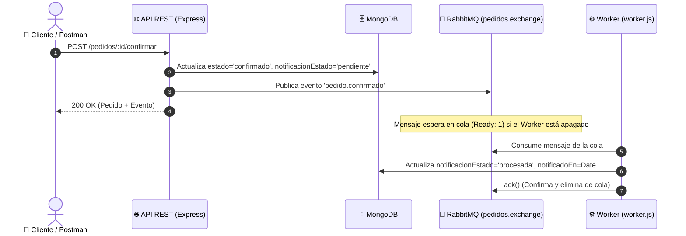

# Evidencias de Pruebas HTTP y Desacople Asincrónico — Clase 04

**Estudiante:** Martín Sciarra  
**Materia:** Integración de Aplicaciones en Entorno Web (IAEW 2026)  
**Fecha:** 07/09/2026  

---

## 🎯 1. Resumen de la Arquitectura Implementada

En esta práctica desacoplamos la confirmación sincrónica de pedidos de su notificación mediante mensajería asincrónica:

* **Broker:** RabbitMQ (en CloudAMQP / Docker)
* **Exchange Directo:** `pedidos.exchange`
* **Routing Key:** `pedido.confirmado`
* **Cola Durable:** `notificaciones.pedido-confirmado`
* **Consumidor:** `src/worker.js` (con confirmaciones manuales `noAck: false`)



---

## 🧪 2. Matriz de Evidencias de Pruebas Realizadas

| # | Paso | Método / Acción | Código Esperado | Evidencia Capturada | Estado de la Cola |
| :-: | :--- | :---: | :---: | :--- | :---: |
| 1 | Creación de Producto | `POST /productos` (`x-api-key`) | `201 Created` | `Screenshot 2026-09-07 201148.png` | Sin cambios |
| 2 | Creación de Pedido | `POST /pedidos` (`write:pedidos`) | `201 Created` | `Screenshot 2026-09-07 201541.png` | Sin cambios |
| 3 | Confirmación (Worker apagado) | `POST /pedidos/:id/confirmar` | `200 OK` | `Screenshot 2026-09-07 201716.png` | Evento emitido |
| 4 | Consulta Inicial Pedido | `GET /pedidos` (`read:pedidos`) | `200 OK` | `Screenshot 2026-09-07 201826.png` | `notificacionEstado: pendiente` |
| 5 | Mensaje esperando en cola | Consola RabbitMQ (CloudAMQP) | - | `Screenshot 2026-09-07 201956.png` | **`Ready: 1`** |
| 6 | Vista general RabbitMQ | Consola RabbitMQ | - | `Screenshot 2026-09-07 202720.png` | Overview |
| 7 | Inicio del Worker y Proceso | Terminal `npm run worker` | - | `Screenshot 2026-09-07 202826.png` | **`Ready: 0` (ack)** |
| 8 | Consulta Final Pedido | `GET /pedidos` (`read:pedidos`) | `200 OK` | `Screenshot 2026-09-07 203505.png` | **`notificacionEstado: procesada`** |
| 9 | Error: Sin Token | `GET /pedidos` (Sin Header) | `401 Unauthorized` | `Screenshot 2026-09-07 203635.png` | 0 eventos agregados |
| 10 | Error: Scope insuficiente | `POST /pedidos` (`sin-permisos`) | `403 Forbidden` | `Screenshot 2026-09-07 203700.png` | 0 eventos agregados |
| 11 | Error: Doble confirmación | `POST /pedidos/:id/confirmar` | `409 Conflict` | `Screenshot 2026-09-07 203729.png` | 0 eventos agregados |

---

## 📦 3. Identificador de Pedido y Payload del Evento

### Pedido Confirmado:
* **Pedido ID:** `6a9f4597daa1a5cf5274124a`
* **Estado:** `confirmado`
* **notificacionEstado Inicial:** `pendiente`
* **notificacionEstado Final:** `procesada`

### Payload del Evento publicado en RabbitMQ:
```json
{
  "eventId": "af112a67-1ef2-4a0d-8df2-fe32bb1a16db",
  "type": "pedido.confirmado",
  "version": 1,
  "occurredAt": "2026-09-07T23:17:16.024Z",
  "data": {
    "pedidoId": "6a9f4597daa1a5cf5274124a"
  }
}
```

---

## 🧠 4. Respuestas Conceptuales de Cierre

### A6 — Explicar el límite (Fallo en RabbitMQ y Reintentos a ciegas)
> **Pregunta:** *¿Qué puede ocurrir si MongoDB guarda el pedido confirmado y RabbitMQ falla antes de publicar? ¿Por qué no conviene reconfirmar a ciegas?*

**Respuesta:**  
Si MongoDB guarda la confirmación y RabbitMQ falla antes de publicar el evento, se produce una inconsistencia (*"escritura dual"*): el pedido figura confirmado en la base de datos, pero el evento nunca se emitió y el cliente jamás recibirá su notificación ni factura.  
No conviene reconfirmar a ciegas porque al reenviar la petición se corre el riesgo de descontar stock dos veces, duplicar cobros o generar errores de negocio (`409 Conflict`).  
La evolución arquitectónica para resolver esto de forma confiable es el **Patrón Outbox** (*Transactional Outbox*), donde el evento se guarda dentro de la misma transacción de la base de datos y un proceso confiable lo lee y publica en RabbitMQ.

---

### A7 — Elegir una integración para el dominio y Agentes de IA

#### A) Integración en el Dominio (E-commerce / FarmaLink):
* **Mecanismo elegido:** Mensajería Asincrónica con RabbitMQ (Colas de eventos).
* **Interacción:** Notificación de pedido listo para retiro / despacho de medicamentos.
* **¿Quién inicia?:** El servicio de Gestión de Pedidos cuando la farmacia arma el paquete.
* **¿Quién recibe?:** El Worker del servicio de Notificaciones (envío de WhatsApp / Email).
* **¿Necesita respuesta inmediata?:** No. La farmacia necesita marcar el pedido como listo y seguir atendiendo; el envío del mensaje al cliente puede demorar unos segundos.
* **¿Qué ocurre si el receptor está caído?:** El mensaje queda persistido en la cola durable de RabbitMQ. Cuando el servicio de notificaciones se reinicie, consumirá todos los mensajes acumulados sin pérdida de datos.

#### B) Pregunta sobre Agentes de IA:
* **¿Qué scope necesita un agente de IA para confirmar un pedido?:**  
  Requiere estrictamente el scope `confirm:pedidos` (Principio de Menor Privilegio).
* **¿Qué debe consultar antes de reintentar tras un error 503?:**  
  Antes de volver a mandar el POST de confirmación, el agente debe hacer una consulta de lectura idempotente (`GET /pedidos/:id`) para comprobar si el pedido ya quedó en estado `confirmado`. Si ya está confirmado, no debe reintentar la confirmación para evitar efectos secundarios.
